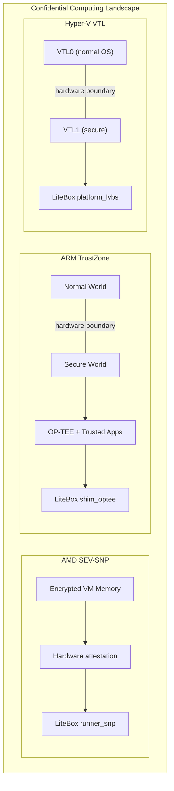
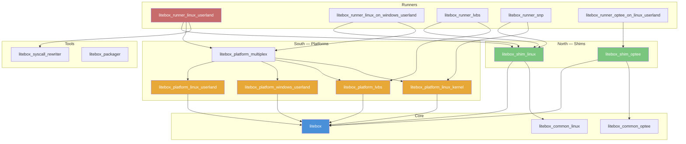
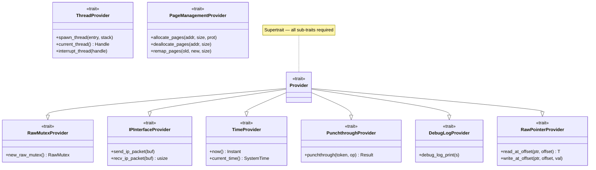
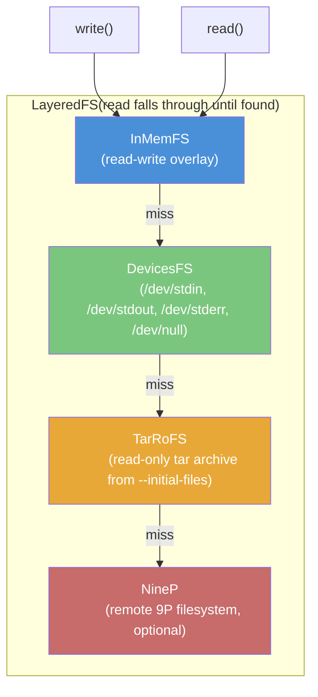
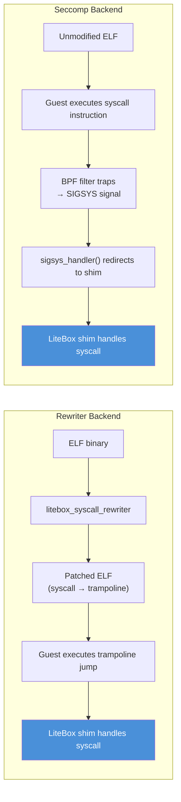
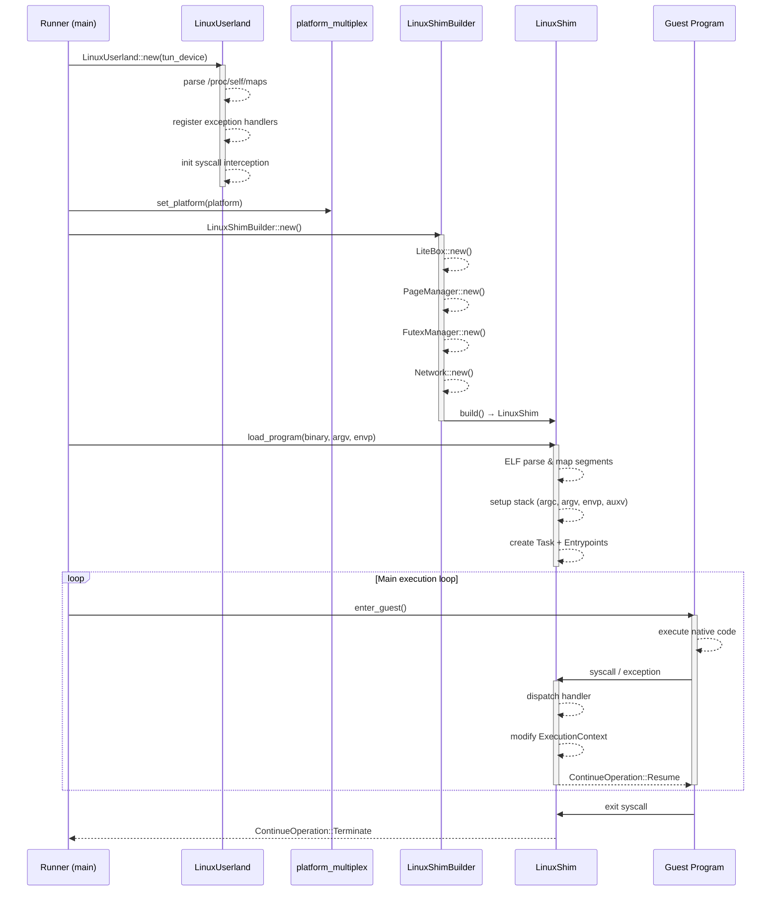
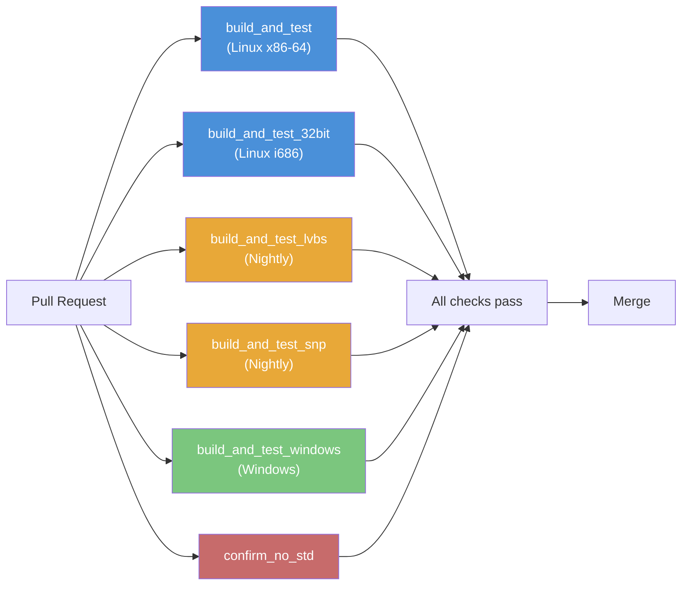

# LiteBox Onboarding Guide

> **Audience**: This guide is written for computer science students and researchers who may be new to library operating systems, confidential computing, and/or the Rust programming language. It aims to provide enough background context to understand *why* LiteBox exists and *how* it works, not just *what* it does.

## 1. What Is LiteBox?

LiteBox is a **security-focused library OS** (sandboxing platform) developed by Microsoft. It drastically reduces the attack surface by minimizing the interface between guest programs and the host OS, enabling **unmodified Linux programs** to run on a variety of substrates:

| Substrate | Platform Crate | Runner |
|-----------|---------------|--------|
| Linux userland | `litebox_platform_linux_userland` | `litebox_runner_linux_userland` |
| Windows userland | `litebox_platform_windows_userland` | `litebox_runner_linux_on_windows_userland` |
| SEV SNP (AMD confidential computing) | `litebox_platform_linux_kernel` | `litebox_runner_snp` |
| LVBS (Hyper-V VTL1 kernel mode) | `litebox_platform_lvbs` | `litebox_runner_lvbs` |
| OP-TEE (ARM TrustZone) | *(via shim)* | `litebox_runner_optee_on_linux_userland` |

**Status**: Pre-1.0, actively evolving (~50 commits from Dec 2024 to Mar 2026). APIs and interfaces may change. The Linux userland substrate is the most mature and the primary development target.

---

## 2. Background Concepts

This section introduces foundational concepts that LiteBox builds upon. If you are already familiar with operating systems internals, syscalls, and Rust, feel free to skip to [Section 3: Architecture](#3-architecture).

### 2.1 What Is a Library OS?

A traditional operating system (Linux, Windows) provides a **monolithic kernel** that manages hardware, memory, processes, filesystems, networking, and more. Every application talks to this kernel through **system calls** (syscalls). The kernel is a single, large, trusted entity with access to everything.

A **library OS** takes a different approach: instead of relying on a shared kernel, each application carries its own "mini operating system" as a library linked into the process. This library implements the OS interfaces (file I/O, memory management, networking) that the application expects, but fulfills them using a much **narrower, simpler interface** to the actual host.

```
Traditional OS:                          Library OS:

┌──────────────┐                        ┌──────────────┐
│  Application  │                        │  Application  │
├──────────────┤                        ├──────────────┤
│              │                        │  Library OS   │  ← LiteBox lives here
│   Kernel     │  ~400 syscalls         │  (in-process) │
│  (monolithic)│  exposed to apps       ├──────────────┤
│              │                        │  Host / VMM   │  ← much narrower interface
└──────────────┘                        └──────────────┘
```

**Why does this matter for security?** A monolithic kernel exposes hundreds of system calls to every application. Each syscall is potential attack surface — a bug in any one of them could be exploited. A library OS reduces this to a handful of essential host operations (allocate memory, send a packet, read the clock), making it much harder for a malicious or buggy application to compromise the host.

**Historical context**: Library OS research dates back to the Exokernel (MIT, 1995) and has seen renewed interest with projects like Drawbridge (Microsoft Research, 2011), Unikernels, and Gramine (formerly Graphene). LiteBox continues this tradition with a focus on security and multi-platform portability.

### 2.2 System Calls (Syscalls)

When a Linux program wants to open a file, allocate memory, or send data over the network, it cannot do so directly — these operations require kernel privileges. Instead, the program makes a **system call**: a controlled transfer from user mode to kernel mode.

On x86-64 Linux, a syscall works like this:

1. The program places the syscall number in the `rax` register (e.g., `rax = 1` for `write`)
2. Arguments go in registers `rdi`, `rsi`, `rdx`, `r10`, `r8`, `r9`
3. The CPU executes the `syscall` instruction
4. The CPU switches to kernel mode and jumps to the kernel's syscall handler
5. The kernel performs the operation and places the result in `rax`
6. Control returns to the program

```
User mode                    Kernel mode
─────────                    ───────────
  mov rax, 1      ───→      syscall handler:
  mov rdi, fd                  validate args
  mov rsi, buf                 write to file
  mov rdx, len                 return bytes written
  syscall          ───→      ───→ result in rax
  ; rax = result   ←───
```

**LiteBox intercepts these syscalls.** Instead of letting them reach the real kernel, LiteBox redirects them into its own handlers (the "shim"), which emulate the expected Linux behavior using only the narrow platform interface. The application doesn't know the difference — it thinks it's talking to a real Linux kernel.

### 2.3 What Is an ABI?

An **Application Binary Interface (ABI)** defines the low-level contract between compiled programs and the system they run on. While an API (Application Programming Interface) is a source-code-level contract (function names, parameter types), an ABI is the **binary-level** contract:

- **Which CPU registers** hold syscall numbers and arguments
- **How the stack is laid out** (alignment, calling conventions)
- **What binary format** executables use (ELF on Linux, PE on Windows)
- **How signals and exceptions** are delivered
- **Data type sizes and alignment** (e.g., `long` is 8 bytes on x86-64 Linux, 4 bytes on Windows)

The Linux ABI on x86-64 specifies, for example, that syscall number goes in `rax`, the first argument in `rdi`, and so on. This is a different ABI from Windows (which uses different registers and a different syscall mechanism) or from OP-TEE (ARM TrustZone's trusted execution environment).

**LiteBox's shim layer emulates an ABI.** The Linux shim (`litebox_shim_linux`) presents the Linux x86-64 ABI to guest programs, so they believe they are running on a real Linux kernel. The OP-TEE shim presents the OP-TEE ABI. This is what "North" means in LiteBox's architecture — the guest-facing ABI surface.

### 2.4 What Is a Shim?

A **shim** is a thin translation layer that sits between two interfaces, making one look like the other. The word comes from woodworking — a shim is a thin piece of material used to fill a gap.

In LiteBox, shims fill the gap between what the guest program expects (e.g., Linux syscalls) and what LiteBox's core library actually provides (a Rust-y, `nix`/`rustix`-inspired internal API). When the guest program issues a `write(fd, buf, len)` syscall, the Linux shim:

1. Reads the syscall number and arguments from CPU registers
2. Translates them into a call to LiteBox's internal filesystem API
3. Writes the result back to the `rax` register
4. Returns control to the guest

The shim is intentionally thin — it does not implement filesystem logic, memory management, or networking itself. It just translates between the guest's ABI and LiteBox's internal abstractions.

### 2.5 ELF: The Executable Format

**ELF (Executable and Linkable Format)** is the standard binary format for programs on Linux and most Unix-like systems. When you compile a C program with `gcc`, the output is an ELF file.

An ELF file contains:

- **Header**: Magic number (`\x7fELF`), architecture (x86-64, ARM), entry point address
- **Program headers**: Describe how to load the binary into memory (which segments to map where, with what permissions)
- **Sections**: `.text` (code), `.data` (initialized data), `.bss` (zeroed data), `.rodata` (constants), etc.
- **Symbol table**: Function and variable names (used by the dynamic linker and debuggers)

LiteBox needs to understand ELF because:
- **The ELF loader** (`litebox_shim_linux/src/loader/elf.rs`) parses the guest binary, maps its segments into the sandbox's virtual memory, sets up the stack, and jumps to the entry point
- **The syscall rewriter** (`litebox_syscall_rewriter`) scans the `.text` section for `syscall` instructions and patches them with trampolines

**Static vs. dynamic linking**: A statically linked binary contains all its code in one file. A dynamically linked binary depends on shared libraries (`.so` files like `libc.so`) that are loaded at runtime by the dynamic linker (`ld-linux-x86-64.so.2`). Dynamic binaries are trickier for LiteBox because every shared library also contains `syscall` instructions that must be intercepted.

### 2.6 Sandboxing and Attack Surface Reduction

**Sandboxing** means running a program in a restricted environment where it cannot access resources beyond what is explicitly allowed. LiteBox is a sandbox — the guest program cannot see the host filesystem, cannot make arbitrary network connections, and cannot call arbitrary kernel syscalls.

**Attack surface** is the set of entry points an attacker could potentially exploit. A Linux kernel exposes ~400 syscalls, each with complex argument handling — that's a large attack surface. LiteBox's platform interface exposes only a handful of primitive operations (allocate pages, send packets, get time), dramatically reducing the attack surface.

This is especially important in **confidential computing** (see next section), where the goal is to protect sensitive data even from the cloud provider's infrastructure.

### 2.7 Confidential Computing

**Confidential computing** protects data *while it is being processed* (in use), not just at rest (encrypted on disk) or in transit (encrypted over the network). This is achieved using hardware-based **Trusted Execution Environments (TEEs)** that create isolated memory regions the host OS and hypervisor cannot read.

LiteBox targets two confidential computing technologies:

#### AMD SEV-SNP (Secure Encrypted Virtualization — Secure Nested Paging)

- Hardware feature in AMD EPYC server processors
- Encrypts the memory of a virtual machine with a key the hypervisor cannot access
- Provides **attestation**: cryptographic proof that the VM is running the expected code
- LiteBox's SNP runner (`litebox_runner_snp`) runs inside an SEV-SNP VM, using the encrypted memory as its execution environment

#### ARM TrustZone / OP-TEE

- Hardware feature in ARM processors that splits the CPU into a "Normal World" and a "Secure World"
- The Secure World runs a trusted OS (OP-TEE) that hosts **Trusted Applications (TAs)**
- TAs handle sensitive operations (key management, biometrics) isolated from the Normal World OS
- LiteBox's OP-TEE shim (`litebox_shim_optee`) allows running OP-TEE trusted applications on non-ARM hardware for development and testing

#### Hyper-V VTL (Virtual Trust Levels)

- Microsoft's virtualization-based security feature
- **VTL0** (normal): Where the standard OS runs
- **VTL1** (secure): A higher-privilege execution environment that VTL0 cannot access
- LiteBox's LVBS platform (`litebox_platform_lvbs`) runs in VTL1, providing hardware-enforced isolation



### 2.8 Rust for Systems Programming

LiteBox is written in **Rust**, a systems programming language that provides memory safety without a garbage collector. If you are coming from C, C++, Java, or Python, here are the key Rust concepts you will encounter in the LiteBox codebase:

#### Ownership and Borrowing

Rust's central innovation is **ownership**: every value has exactly one owner, and the value is dropped (freed) when the owner goes out of scope. You can **borrow** a value temporarily via references (`&T` for read-only, `&mut T` for read-write), but the compiler enforces that you never have a mutable reference and other references at the same time. This eliminates data races and use-after-free bugs at compile time.

```rust
let s = String::from("hello");   // s owns the string
let r = &s;                       // r borrows s (read-only)
println!("{r}");                  // OK: reading through a borrow
// let m = &mut s;                // ERROR: can't mutably borrow while r exists
```

#### Traits (like interfaces)

Traits define shared behavior. LiteBox uses traits extensively — the entire Platform abstraction is a trait hierarchy. If you know Java interfaces or C++ abstract classes, traits are similar:

```rust
trait TimeProvider {
    fn now(&self) -> Instant;           // must be implemented
    fn elapsed(&self) -> Duration {     // can have default implementations
        self.now().elapsed()
    }
}

// Each platform implements the trait differently:
impl TimeProvider for LinuxUserland { ... }
impl TimeProvider for WindowsUserland { ... }
```

#### Generics and Monomorphization

LiteBox uses **generic type parameters** extensively. For example, `LiteBox<Platform>` and `PageManager<Platform, ALIGN>` are generic over the platform type. At compile time, Rust generates specialized code for each concrete type (called *monomorphization*), so generics have **zero runtime cost** — the compiler produces code as efficient as if you had written it by hand for each platform.

#### `#[no_std]`

By default, Rust programs link to the **standard library** (`std`), which provides heap allocation, file I/O, threading, and other OS-dependent features. Code marked `#[no_std]` opts out of `std` and uses only `core` (language primitives) and optionally `alloc` (heap allocation). This is essential for code that runs in kernel mode, on bare metal, or inside a hypervisor — environments where the standard library's OS assumptions don't hold.

LiteBox's core crate is `#[no_std]` because it must run on bare-metal platforms like LVBS and SNP where there is no underlying OS to provide `std`'s functionality.

#### `unsafe`

Rust's safety guarantees cover most code, but some low-level operations (raw pointer dereferencing, calling foreign functions, inline assembly) require `unsafe` blocks. Inside `unsafe`, the programmer takes responsibility for upholding safety invariants. LiteBox's code guidelines require every `unsafe` block to have a `// SAFETY:` comment explaining why the operation is sound.

#### Key Syntax You Will See

| Syntax | Meaning |
|--------|---------|
| `fn foo(&self)` | Method taking an immutable reference to `self` |
| `fn foo(&mut self)` | Method taking a mutable reference to `self` |
| `Arc<T>` | Atomically reference-counted smart pointer (thread-safe shared ownership) |
| `Box<T>` | Heap-allocated value with single ownership |
| `Option<T>` | A value that may or may not be present (`Some(value)` or `None`) |
| `Result<T, E>` | An operation that may succeed (`Ok(value)`) or fail (`Err(error)`) |
| `impl Trait for Type` | Implementing a trait (interface) for a concrete type |
| `dyn Trait` | Dynamic dispatch (runtime polymorphism, like virtual methods in C++) |
| `where P: Provider` | Generic constraint: `P` must implement the `Provider` trait |
| `cfg(feature = "...")` | Conditional compilation based on feature flags |
| `pub(crate)` | Visible within this crate only (not to external users) |

#### Recommended Resources

- [The Rust Book](https://doc.rust-lang.org/book/) — official tutorial, start here
- [Rust by Example](https://doc.rust-lang.org/rust-by-example/) — learn by reading annotated examples
- [Rustlings](https://github.com/rust-lang/rustlings) — small exercises to practice Rust
- [The Rustonomicon](https://doc.rust-lang.org/nomicon/) — advanced: understanding `unsafe` Rust (relevant for LiteBox's low-level code)

### 2.9 Virtual Memory Concepts

LiteBox manages virtual memory for guest programs, so understanding these concepts is important:

- **Virtual address space**: Each process sees its own private address space. Addresses in the program (pointers) are *virtual* — the CPU's MMU (Memory Management Unit) translates them to physical addresses using **page tables**.
- **Pages**: Memory is managed in fixed-size blocks called pages (typically 4 KiB on x86). Operations like allocation, protection, and mapping work at page granularity.
- **Memory protection**: Each page has permission bits — readable, writable, executable (R/W/X). Attempting a disallowed operation causes a **page fault** (exception). LiteBox uses this to enforce code integrity (code pages are R-X, not writable).
- **Copy-on-Write (CoW)**: A memory optimization where two processes share the same physical pages until one writes to them, at which point a private copy is made. LiteBox recently added CoW support for platforms that support it.
- **`mmap`**: The Linux syscall for mapping memory — creating new pages, mapping files into memory, or sharing memory between processes. LiteBox's memory manager emulates `mmap` behavior inside the sandbox.
- **Demand paging**: Pages are allocated in the page table but not backed by physical memory until first accessed. The first access triggers a page fault, and the OS (or LiteBox) then allocates the physical page. This saves memory for large but sparsely-used allocations.

---

## 3. Architecture

### 3.1 The North-South Pattern

LiteBox is designed around a **North-South extensibility pattern** that cleanly separates guest-facing ABI emulation from host-facing platform implementation:

```
               ┌────────────────────────────────────────────────┐
               │   Guest Program (unmodified Linux ELF)         │
               ├────────────────────────────────────────────────┤
  "North"      │   Shim Layer                                   │
  (guest ABI)  │   litebox_shim_linux  — Linux syscall ABI      │
               │   litebox_shim_optee  — OP-TEE ABI             │
               ├────────────────────────────────────────────────┤
  Core         │   litebox (library OS)                         │
               │   fd · fs · mm · net · sync · event · pipes    │
               │   #[no_std] compatible                         │
               ├────────────────────────────────────────────────┤
  "South"      │   Platform Implementation                      │
  (host)       │   litebox_platform_linux_userland              │
               │   litebox_platform_windows_userland            │
               │   litebox_platform_lvbs                        │
               │   litebox_platform_linux_kernel (SNP)          │
               ├────────────────────────────────────────────────┤
  Entry point  │   Runner (wires North to South + CLI)          │
               │   litebox_runner_linux_userland                │
               └────────────────────────────────────────────────┘
```

Any North shim can be paired with any South platform via a runner, enabling combinations like "Linux ABI on Windows" or "OP-TEE ABI on Linux userland."

#### Crate Dependency Graph



### 3.2 The Platform Trait

The central abstraction is the **`Provider` trait** (`litebox/src/platform/mod.rs:43`), a supertrait composing several sub-traits:

| Sub-trait | Responsibility |
|-----------|---------------|
| `RawMutexProvider` | Futex-like synchronization primitives (wake, block, timeout) |
| `IPInterfaceProvider` | Raw IP packet send/receive (TUN integration) |
| `TimeProvider` | Monotonic and wall-clock time |
| `PunchthroughProvider` | Token-based escape hatch for operations that bypass the sandbox |
| `DebugLogProvider` | Async-signal-safe debug output |
| `RawPointerProvider` | User/kernel pointer abstraction (safe reads/writes across address spaces) |

Additional traits extend the platform for specific capabilities:

| Trait | Responsibility |
|-------|---------------|
| `ThreadProvider` | Thread spawn/interrupt/handle management |
| `PageManagementProvider<ALIGN>` | Virtual memory allocation, deallocation, protection, page fault handling |
| `StdioProvider` | stdin/stdout/stderr and TTY detection |
| `SystemInfoProvider` | Syscall entry point, VDSO address |
| `CrngProvider` | Cryptographic random number generation |
| `ThreadLocalStorageProvider` | Per-thread TLS |

Each South platform implements these traits for its target environment. The platform type is selected at compile time via feature flags in `litebox_platform_multiplex`.

#### Trait Hierarchy



### 3.3 The Shim Interface

Shims implement the `EnterShim` trait (`litebox/src/shim.rs:25`), which the platform calls when the guest triggers a syscall or exception:

```rust
trait EnterShim {
    type ExecutionContext;
    fn init(&self, ctx: &mut Self::ExecutionContext) -> ContinueOperation;
    fn syscall(&self, ctx: &mut Self::ExecutionContext) -> ContinueOperation;
    fn exception(&self, ctx: &mut Self::ExecutionContext, info: ExceptionInfo) -> ContinueOperation;
    fn interrupt(&self, ctx: &mut Self::ExecutionContext) -> ContinueOperation;
}
```

The shim reads the syscall number/arguments from the execution context (CPU registers), dispatches to the appropriate handler (file, process, mm, net, etc.), writes the result back, and returns `ContinueOperation::Resume` or `Terminate`.

### 3.4 Core Library Modules

The `litebox` crate (`#[no_std]`) provides the OS abstractions that shims use:

| Module | Purpose | Key types |
|--------|---------|-----------|
| `fd/` | File descriptor table | `Descriptors<P>`, `TypedFd<Subsystem>` |
| `fs/` | Filesystem trait + implementations | `FileSystem` trait, `InMemFS`, `DevicesFS`, `TarRoFS`, `LayeredFS`, `NineP` |
| `mm/` | Virtual memory management | `PageManager<P, ALIGN>`, `Vmem`, `VmArea`, buddy allocator |
| `net/` | TCP/UDP/ICMP/RAW networking (smoltcp) | `Network<P>`, `SocketSet`, TUN device integration |
| `sync/` | Synchronization primitives | `Mutex<P, T>`, `RwLock<P, T>`, `Condvar<P>`, `FutexManager` |
| `event/` | I/O event polling | `Events` bitflags, `IOPollable` trait, observer pattern |
| `pipes/` | Named and unnamed pipes | `Pipes` |
| `shim.rs` | Shim interface traits | `EnterShim`, `InitThread`, `ContinueOperation` |

#### Filesystem Layering

The Linux shim composes filesystems in a layered stack:



Writes always go to the in-memory layer; reads fall through layers until a file is found.

### 3.5 Syscall Interception

LiteBox intercepts guest syscalls via two backends:

#### Rewriter Backend (default, recommended)

`litebox_syscall_rewriter` performs **ahead-of-time binary rewriting**:

1. Scans ELF `.text` sections for `syscall` instructions
2. Replaces each with a jump to a trampoline appended to the binary
3. The trampoline redirects into the LiteBox shim
4. Output layout: `[original ELF][page-aligned padding][trampoline code][header with magic "LITEBOX0"]`

For dynamically linked programs, `litebox_rtld_audit.so` hooks the dynamic linker via the `LD_AUDIT` interface to rewrite shared libraries as they are loaded.

#### Seccomp Backend

Uses Linux `SECCOMP_RET_TRAP` to catch syscalls at runtime:

1. A BPF filter is loaded that traps most syscalls (allow-list for essential ones like `futex`, `mmap`)
2. Trapped syscalls raise `SIGSYS`, handled by `sigsys_handler()`
3. The handler redirects execution into the shim's `syscall_callback`
4. A magic argument (`"LITE BOX"` / `0x584f4254_4954494c`) distinguishes LiteBox's own syscalls from guest syscalls

The rewriter is faster (no signal overhead) but requires pre-processing all binaries. Seccomp works on unmodified binaries but has higher per-syscall cost.

#### Syscall Interception Flow



### 3.6 Startup Sequence (Linux Userland)



Detailed pseudocode:

```
litebox_runner_linux_userland::main()
  │
  ├─ Parse CLI arguments (clap)
  ├─ Load program binary (from host FS or TAR)
  ├─ Optionally rewrite syscalls (litebox_syscall_rewriter::hook_syscalls_in_elf)
  │
  ├─ LinuxUserland::new(tun_device)          ← create platform singleton
  │    ├─ Parse /proc/self/maps, locate VDSO
  │    ├─ Register exception handlers
  │    └─ Init syscall interception (seccomp filter if applicable)
  │
  ├─ litebox_platform_multiplex::set_platform()
  │
  ├─ LinuxShimBuilder::new()
  │    ├─ LiteBox::new(platform)             ← core state
  │    ├─ PageManager::new()                 ← virtual memory
  │    ├─ FutexManager::new()                ← synchronization
  │    ├─ Network::new()                     ← smoltcp stack
  │    └─ Pipes::new()                       ← IPC
  │
  ├─ LinuxShimBuilder::build() → LinuxShim<FS>
  │    └─ GlobalState { platform, pm, fs, futex_manager, pipes, net, ... }
  │
  ├─ LinuxShim::load_program(binary, argv, envp)
  │    ├─ ELF loader: parse headers, map segments
  │    ├─ Stack setup: argc, argv, envp, auxiliary vector
  │    └─ Create Task<FS> + LinuxShimEntrypoints<FS>
  │
  └─ Platform main loop:
       while running:
         enter_guest(LinuxShimEntrypoints)
           ├─ Guest executes natively
           ├─ On syscall → EnterShim::syscall(ctx) → dispatch → modify ctx → Resume
           ├─ On exception → EnterShim::exception(ctx, info) → handle → Resume/Terminate
           └─ Re-enter guest
```

---

## 4. Crate Map

### Core

| Crate | Description |
|-------|-------------|
| `litebox` | Core library OS: fd, fs, mm, net, sync, event, pipes. `#[no_std]` compatible. |
| `litebox_common_linux` | Linux-specific constants, types, syscall numbers |
| `litebox_common_optee` | OP-TEE-specific definitions |

### Shims (North)

| Crate | Description |
|-------|-------------|
| `litebox_shim_linux` | Linux ABI emulation — syscall handlers for file, process, mm, net, epoll, signal, etc. |
| `litebox_shim_optee` | OP-TEE ABI emulation for trusted applications |

### Platforms (South)

| Crate | Description |
|-------|-------------|
| `litebox_platform_linux_userland` | Runs on standard Linux. Uses `mmap`/`mprotect` for memory, TUN for networking, seccomp for interception. |
| `litebox_platform_windows_userland` | Runs on Windows. Uses `VirtualAlloc2`/`VirtualProtect`, vectored exception handlers. |
| `litebox_platform_lvbs` | Hyper-V VTL1 kernel mode. Custom page tables, hardware features (DEP, SMEP, SMAP). Requires nightly + custom target. |
| `litebox_platform_linux_kernel` | Linux kernel module platform. Used by the SNP runner for SEV SNP confidential computing. |
| `litebox_platform_multiplex` | Compile-time platform selection via feature flags. Provides a global `Platform` type alias and singleton accessor. |

### Runners (Entry Points)

| Crate | Description |
|-------|-------------|
| `litebox_runner_linux_userland` | Main development runner. CLI with `--rewrite-syscalls`, `--initial-files`, `--tun-device-name`, etc. |
| `litebox_runner_linux_on_windows_userland` | Runs Linux binaries on Windows via the Windows platform. |
| `litebox_runner_lvbs` | LVBS runner. Requires nightly toolchain and custom `x86_64_vtl1.json` target. |
| `litebox_runner_snp` | SEV SNP runner. Requires nightly toolchain and custom `target.json`. |
| `litebox_runner_optee_on_linux_userland` | Runs OP-TEE trusted applications on Linux. |

### Tools

| Crate | Description |
|-------|-------------|
| `litebox_syscall_rewriter` | AOT binary rewriter. Replaces `syscall` instructions with trampolines. Supports x86-64 and i386. |
| `litebox_packager` | Packages ELF programs into self-contained LiteBox bundles. |
| `litebox_rtld_audit` | Shared library (`.so`) that hooks dynamically loaded libraries via rtld audit interface. |

### Utilities

| Crate | Description |
|-------|-------------|
| `litebox_util_log` | Unified logging facade |
| `litebox_util_log_macros` | Procedural macros for logging |
| `dev_tests` | CI-only test crate (not released) |
| `dev_bench` | CI-only benchmark crate (not released) |

---

## 5. Building and Running

### Prerequisites

- **Rust stable** toolchain (pinned in `rust-toolchain.toml`)
- `cargo-nextest` for testing
- `gcc` for compiling test C programs
- Optional: `iperf3`, `diod`, TUN device for network tests

### Common Commands

```bash
# Format (required before every commit)
cargo fmt

# Build everything
cargo build

# Build a single crate
cargo build -p litebox_runner_linux_userland

# Lint (pedantic clippy, workspace-wide)
cargo clippy --all-targets --all-features

# Run all tests
cargo nextest run

# Run tests for a single crate
cargo nextest run -p litebox_runner_linux_userland

# Run a specific test
cargo nextest run -p litebox_runner_linux_userland test_static_exec_with_rewriter

# Run doc tests (nextest doesn't support these)
cargo test --doc

# Build documentation
cargo doc --no-deps --all-features --document-private-items
```

### Running a Program in the Sandbox

#### Static binary (simplest)

```bash
gcc -static -o /tmp/hello_static hello.c

cargo run -p litebox_runner_linux_userland -- \
  -Z --rewrite-syscalls /tmp/hello_static
```

`-Z` enables unstable options. `--rewrite-syscalls` rewrites syscall sites in-place before execution.

#### Dynamic binary

Dynamic binaries require all shared libraries to be rewritten and packaged:

```bash
RUNNER=./target/debug/litebox_runner_linux_userland
REWRITER=./target/debug/litebox_syscall_rewriter
TARDIR=/tmp/litebox_rootfs
TARFILE=/tmp/litebox_rootfs.tar

# 1. Rewrite the main binary
$REWRITER /tmp/hello -o /tmp/hello.hooked

# 2. Rewrite all shared library dependencies
rm -rf $TARDIR && mkdir -p $TARDIR
for dep in $(ldd /tmp/hello | grep -oP '/[^ ]+' | grep -v 'linux-vdso'); do
    destdir="$TARDIR/$(dirname $dep)"
    mkdir -p "$destdir"
    $REWRITER "$dep" -o "$destdir/$(basename $dep)"
done

# 3. Create the rootfs tar
tar -C $TARDIR -cf $TARFILE .

# 4. Run
$RUNNER -Z \
  --interception-backend rewriter \
  --initial-files $TARFILE \
  --env LD_LIBRARY_PATH=/lib64:/lib32:/lib \
  /tmp/hello.hooked
```

### CLI Reference

| Flag | Description |
|------|-------------|
| `-Z` / `--unstable` | Enable unstable options |
| `--rewrite-syscalls` | Rewrite syscall sites in the binary before running |
| `--interception-backend rewriter\|seccomp` | Syscall interception method (default: `rewriter`) |
| `--initial-files <path.tar>` | Mount a tar archive as initial rootfs |
| `--program-from-tar` | Load program binary from the tar instead of host FS |
| `--env K=V` | Pass environment variable into the sandbox (repeatable) |
| `--forward-env` | Forward host environment variables into the sandbox |
| `--tun-device-name <name>` | Attach to a TUN device for networking |

---

## 6. Testing

### Test Runner

LiteBox uses **cargo-nextest** as the primary test runner. Configuration lives in `.config/nextest.toml`.

```bash
# All tests
cargo nextest run

# Single crate
cargo nextest run -p litebox_runner_linux_userland

# Single test
cargo nextest run -p litebox_runner_linux_userland test_static_exec_with_rewriter

# Doc tests (separate, nextest doesn't support these)
cargo test --doc

# 32-bit tests (CI validates both architectures)
cargo nextest run --target=i686-unknown-linux-gnu
```

### Test Profiles

| Profile | Behavior |
|---------|----------|
| `default` | Fail-fast, no retries. Flakiness shows up early during development. |
| `ci` | Non-fail-fast, 10-minute timeout, retries for known flaky tests. |

### Expected Failures on Dev Machines

Some tests require infrastructure that CI provides but dev machines typically lack:

| Test | Requirement |
|------|-------------|
| `test_node_with_rewriter` | Node.js installed |
| `test_tun_and_runner_with_iperf3` | TUN device (setup via `litebox_platform_linux_userland/scripts/tun-setup.sh`) + `iperf3` |
| `test_runner_with_python` | Skipped in CI; can be slow (~235s) |

### Integration Tests

The main integration test suite is `litebox_runner_linux_userland/tests/run.rs`. Tests compile small C programs, run them inside LiteBox, and verify output.

---

## 7. CI/CD Pipeline

CI is defined in `.github/workflows/ci.yml`. All jobs must pass before merging.



### Jobs

| Job | What it checks |
|-----|---------------|
| **build_and_test** (Linux x86-64) | `cargo fmt --check`, clippy, build, nextest, doc tests, doc generation |
| **build_and_test_32bit** (Linux i686) | Same checks targeting 32-bit |
| **build_and_test_lvbs** | Nightly toolchain, `-Z build-std`, custom `x86_64_vtl1.json` target |
| **build_and_test_snp** | Nightly toolchain, `-Z build-std`, custom `target.json` |
| **build_and_test_windows** | Windows-specific clippy and tests |
| **confirm_no_std** | Core crates build with `--target x86_64-unknown-none` (no accidental `std` pulls) |

### Environment

- `RUSTFLAGS=-Dwarnings` and `RUSTDOCFLAGS=-Dwarnings` — warnings are errors
- `cargo build --locked` — locked dependency resolution
- Rust cache via `Swatinem/rust-cache`
- CI installs `iperf3`, `diod`, and sets up TUN device

---

## 8. Development Status

### What Is Stable

- **North-South architecture**: The `Provider` and `EnterShim` traits are well-established and unlikely to change fundamentally.
- **Linux userland platform**: Most mature substrate. Used daily for development and testing.
- **Syscall rewriter**: Core functionality is stable. Supports x86-64 and i386 ELF binaries.
- **Core fs/fd/mm/net modules**: APIs are functional and exercised by the test suite.

### Active Development Areas

Based on recent commit history:

| Area | Recent Work |
|------|-------------|
| **9P filesystem** | New 9P protocol support connected with Linux shim (remote file access) |
| **Packaging** | New `litebox_packager` tool for self-contained ELF bundles |
| **Copy-on-Write** | Opportunistic CoW for platforms that support it; partial `MAP_SHARED` |
| **LVBS platform** | Per-CPU variable refactoring, kernel address space remapping, DEP/SMEP/SMAP |
| **SNP platform** | Network worker, bug fixes |
| **OP-TEE** | Refactored message types, multi-instance page table isolation |
| **Demand paging** | LVBS demand paging and fallible memory copies |
| **Logging** | New unified logging facade crate |

### Known Limitations

- **Pre-1.0**: APIs may change without notice
- **No process isolation**: LiteBox runs a single process (no fork into separate address spaces)
- **Filesystem**: Guest sees only what is explicitly provided (no host FS passthrough by default)
- **Networking**: Requires TUN device setup for IP networking
- **Dynamic linking**: Requires manual rewriting and packaging of all shared libraries
- **Python test**: Flaky/slow, skipped in CI

---

## 9. Code Guidelines

### Before Every Commit

1. `cargo fmt` — non-negotiable
2. `cargo build`
3. `cargo clippy --all-targets --all-features`
4. `cargo nextest run`

### Key Rules

- **`unsafe` code**: Minimize. Every `unsafe` block must have a `// SAFETY:` comment explaining soundness.
- **`no_std`**: The core `litebox` crate must remain `no_std`. Favor `no_std` in new crates. `std` is allowed in runners and userland platforms.
- **Dependencies**: Justify additions. Use `default-features = false`. Minimize external deps.
- **Testing**: Write unit tests for new functionality. Integration tests go in each runner's `tests/` directory.
- **Documentation**: Document all public APIs and non-trivial logic.
- **Clippy**: Pedantic lints enabled workspace-wide (see `Cargo.toml` for allow-listed exceptions).

---

## 10. Key Source Files

| File | What to look at |
|------|----------------|
| `litebox/src/platform/mod.rs` | `Provider` trait and all sub-traits — the central abstraction |
| `litebox/src/platform/page_mgmt.rs` | `PageManagementProvider` — virtual memory interface |
| `litebox/src/shim.rs` | `EnterShim` and `InitThread` — the North interface contract |
| `litebox/src/litebox.rs` | `LiteBox<P>` struct — core state and descriptor table |
| `litebox/src/fs/mod.rs` | `FileSystem` trait — all FS operations |
| `litebox/src/mm/mod.rs` | `PageManager` — memory management |
| `litebox/src/net/mod.rs` | `Network` — smoltcp-based networking |
| `litebox_shim_linux/src/lib.rs` | `LinuxShimBuilder`, `GlobalState`, `LinuxShimEntrypoints` |
| `litebox_shim_linux/src/syscalls/` | Per-category syscall handlers (file, process, mm, net, etc.) |
| `litebox_platform_linux_userland/src/lib.rs` | `LinuxUserland` — the most common platform |
| `litebox_platform_multiplex/src/lib.rs` | Compile-time platform type selection |
| `litebox_runner_linux_userland/src/lib.rs` | CLI args and startup flow |
| `litebox_syscall_rewriter/src/lib.rs` | ELF binary rewriter |
| `.github/workflows/ci.yml` | CI pipeline definition |
| `.config/nextest.toml` | Test runner configuration |

---

## 11. Glossary

| Term | Definition |
|------|-----------|
| **ABI** | Application Binary Interface — the low-level binary contract between a program and the OS: register conventions, syscall numbers, data layout. See [Section 2.3](#23-what-is-an-abi) |
| **Attack surface** | The set of entry points an attacker could potentially exploit. Reducing attack surface is LiteBox's primary security goal |
| **BPF / eBPF** | Berkeley Packet Filter — a bytecode format used by Linux for in-kernel programmable filters. LiteBox uses BPF programs to implement seccomp syscall filtering |
| **Confidential computing** | Hardware-based protection of data while in use, using TEEs. See [Section 2.7](#27-confidential-computing) |
| **CoW** | Copy-on-Write — memory pages shared between contexts until written, then privately copied |
| **ELF** | Executable and Linkable Format — the standard binary format on Linux. See [Section 2.5](#25-elf-the-executable-format) |
| **Futex** | Fast Userspace Mutex — a Linux synchronization primitive that avoids syscalls in the uncontended case. LiteBox's `RawMutexProvider` implements futex-like semantics |
| **Library OS** | An OS architecture where each application carries its own OS services as a library, using a narrow host interface. See [Section 2.1](#21-what-is-a-library-os) |
| **LVBS** | Hyper-V's "Lightweight Virtual Boot Service" — runs in VTL1 kernel mode |
| **MMU** | Memory Management Unit — CPU hardware that translates virtual addresses to physical addresses using page tables |
| **`#[no_std]`** | Rust attribute opting out of the standard library for bare-metal / kernel compatibility. See [Section 2.8](#28-rust-for-systems-programming) |
| **North** | Guest-facing side of LiteBox — the ABI that guest programs see (Linux syscalls, OP-TEE calls) |
| **OP-TEE** | Open Portable Trusted Execution Environment — an open-source trusted OS for ARM TrustZone |
| **Page fault** | A CPU exception raised when a program accesses an unmapped or protected memory page. LiteBox handles page faults to implement demand paging and memory protection |
| **Platform** | A South component implementing the `Provider` trait for a specific execution environment |
| **Punchthrough** | A token-gated escape hatch allowing specific operations to bypass the sandbox |
| **Runner** | An executable that wires a specific shim to a specific platform and provides a CLI |
| **Rewriter** | The `litebox_syscall_rewriter` tool that patches `syscall` instructions in ELF binaries |
| **Seccomp** | Secure Computing mode — a Linux feature that restricts which syscalls a process can make. LiteBox uses it as one of two syscall interception backends |
| **Shim** | A thin translation layer between two interfaces. In LiteBox, shims translate guest ABI calls into internal API calls. See [Section 2.4](#24-what-is-a-shim) |
| **smoltcp** | An embedded, `#[no_std]`-compatible TCP/IP stack used by LiteBox for networking without relying on the host kernel's network stack |
| **SNP** | AMD SEV-SNP — Secure Encrypted Virtualization with Secure Nested Paging (confidential computing) |
| **South** | Host-facing side — the platform implementation that provides hardware/OS access |
| **Syscall** | System call — the mechanism for user-mode programs to request OS services. See [Section 2.2](#22-system-calls-syscalls) |
| **TEE** | Trusted Execution Environment — hardware-isolated region for sensitive computation (SEV-SNP, TrustZone, SGX) |
| **Trampoline** | A small code stub that redirects execution elsewhere. The syscall rewriter replaces `syscall` instructions with jumps to trampolines that redirect into LiteBox's shim |
| **Trait** | Rust's mechanism for defining shared behavior (similar to interfaces in Java or abstract classes in C++). LiteBox's architecture is built on trait hierarchies |
| **TUN** | A virtual network device operating at the IP layer (layer 3). Unlike TAP (layer 2 / Ethernet frames), TUN works with IP packets directly |
| **VDSO** | Virtual Dynamic Shared Object — a small shared library mapped into every Linux process by the kernel, providing fast implementations of certain syscalls (like `gettimeofday`) without a full context switch |
| **VTL** | Virtual Trust Level — Hyper-V isolation boundary (VTL0 = normal, VTL1 = secure) |

---

## 12. Further Reading

### Library OS Research

- D. Engler et al., "Exokernel: An Operating System Architecture for Application-Level Resource Management," SOSP 1995
- D. Porter et al., "Rethinking the Library OS from the Top Down," ASPLOS 2011 (Drawbridge)
- T. Tsai et al., "Graphene-SGX: A Practical Library OS for Unmodified Applications on SGX," USENIX ATC 2017

### Confidential Computing

- AMD SEV-SNP whitepaper: "Strengthening VM Isolation with Integrity Protection and More" (AMD, 2020)
- ARM TrustZone documentation: ARM Security Technology — Building a Secure System using TrustZone Technology
- Confidential Computing Consortium: https://confidentialcomputing.io/

### Rust

- [The Rust Programming Language](https://doc.rust-lang.org/book/) — the official book
- [Rust by Example](https://doc.rust-lang.org/rust-by-example/)
- [The Rustonomicon](https://doc.rust-lang.org/nomicon/) — advanced `unsafe` Rust
- [Writing an OS in Rust](https://os.phil-opp.com/) — blog series on bare-metal Rust OS development (relevant to understanding `#[no_std]`)

### Linux Internals

- Robert Love, "Linux Kernel Development," 3rd ed. (understanding syscalls, memory management, scheduling)
- Michael Kerrisk, "The Linux Programming Interface" (comprehensive syscall reference)
- `man 2 syscall` — Linux syscall convention documentation
