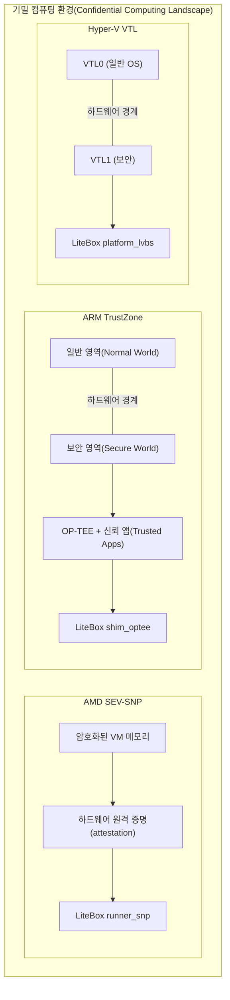
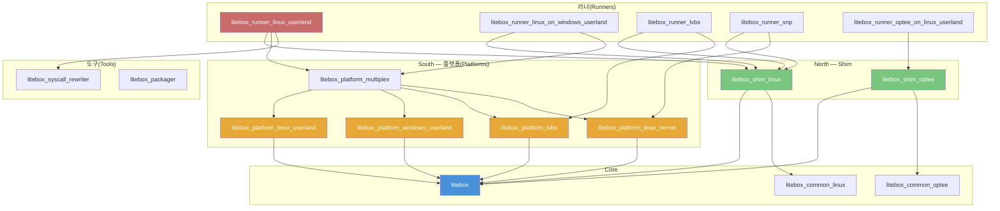
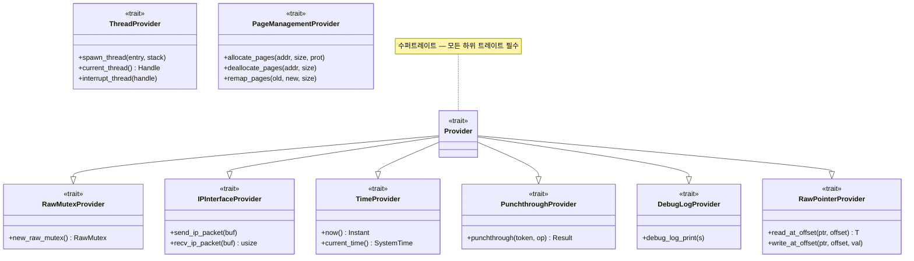
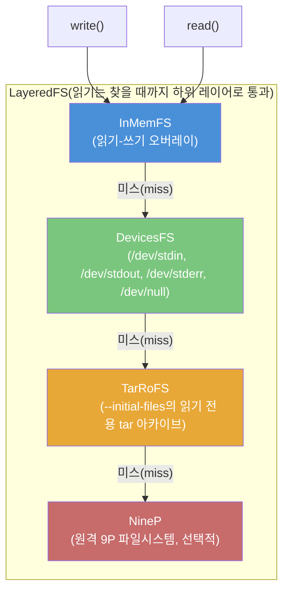
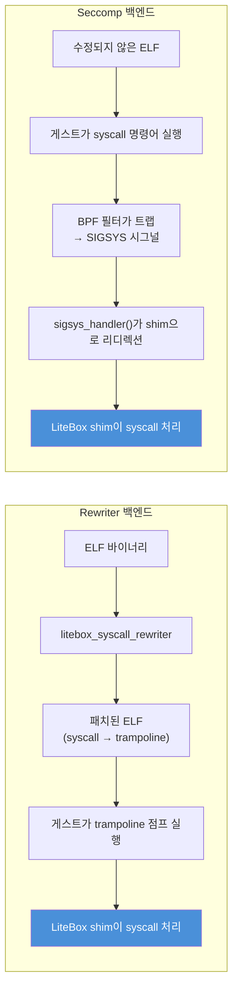
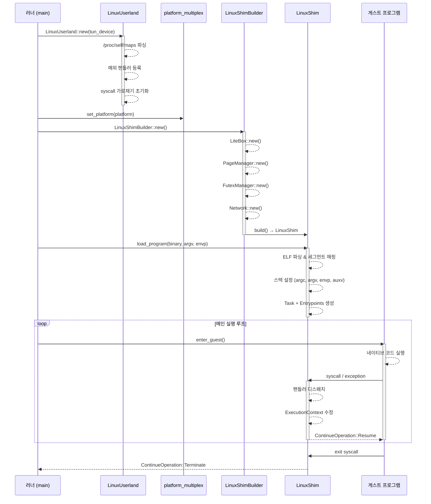
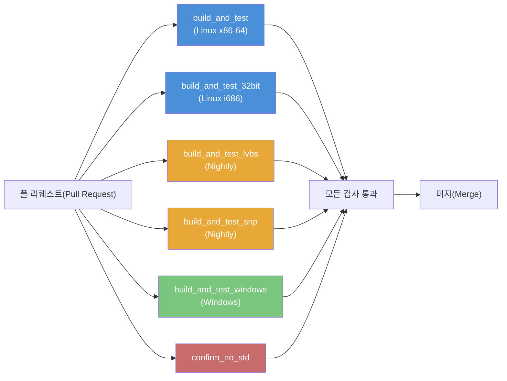

# LiteBox 온보딩 가이드

> **대상 독자**: 이 가이드는 라이브러리 운영체제(library OS), 기밀 컴퓨팅(confidential computing), 그리고/또는 Rust 프로그래밍 언어에 익숙하지 않을 수 있는 컴퓨터 과학 학생 및 연구자를 위해 작성되었습니다. LiteBox가 *무엇을* 하는지뿐만 아니라 *왜* 존재하고 *어떻게* 작동하는지 이해할 수 있도록 충분한 배경 지식을 제공하는 것을 목표로 합니다.

## 1. LiteBox란?

LiteBox는 Microsoft에서 개발한 **보안 중심 라이브러리 OS**(샌드박싱 플랫폼)입니다. 게스트 프로그램과 호스트 OS 사이의 인터페이스를 최소화하여 공격 표면(attack surface)을 대폭 줄이며, **수정되지 않은 Linux 프로그램**을 다양한 기반 환경(substrate)에서 실행할 수 있습니다:

| 기반 환경(Substrate) | 플랫폼 크레이트(Platform Crate) | 러너(Runner) |
|-----------|---------------|--------|
| Linux 사용자 공간(userland) | `litebox_platform_linux_userland` | `litebox_runner_linux_userland` |
| Windows 사용자 공간(userland) | `litebox_platform_windows_userland` | `litebox_runner_linux_on_windows_userland` |
| SEV SNP (AMD 기밀 컴퓨팅) | `litebox_platform_linux_kernel` | `litebox_runner_snp` |
| LVBS (Hyper-V VTL1 커널 모드) | `litebox_platform_lvbs` | `litebox_runner_lvbs` |
| OP-TEE (ARM TrustZone) | *(shim을 통해)* | `litebox_runner_optee_on_linux_userland` |

**현황**: 1.0 이전(pre-1.0) 버전으로, 활발히 발전 중입니다 (2024년 12월부터 2026년 3월까지 약 50개 커밋). API와 인터페이스는 변경될 수 있습니다. Linux 사용자 공간 기반 환경이 가장 성숙하며 주요 개발 대상입니다.

---

## 2. 배경 개념

이 섹션에서는 LiteBox가 기반으로 하는 기초 개념을 소개합니다. 운영체제 내부 구조, 시스템 콜(syscall), Rust에 이미 익숙하다면 [섹션 3: 아키텍처](#3-아키텍처)로 건너뛰어도 됩니다.

### 2.1 라이브러리 OS(Library OS)란?

전통적인 운영체제(Linux, Windows)는 하드웨어, 메모리, 프로세스, 파일시스템, 네트워킹 등을 관리하는 **모놀리식 커널(monolithic kernel)**을 제공합니다. 모든 애플리케이션은 **시스템 콜(syscall)**을 통해 이 커널과 통신합니다. 커널은 모든 것에 접근 권한을 가진 단일한 대형 신뢰 엔티티입니다.

**라이브러리 OS**는 다른 접근 방식을 취합니다: 공유 커널에 의존하는 대신, 각 애플리케이션이 프로세스에 링크된 라이브러리 형태로 자체 "미니 운영체제"를 가지고 다닙니다. 이 라이브러리는 애플리케이션이 기대하는 OS 인터페이스(파일 I/O, 메모리 관리, 네트워킹)를 구현하지만, 실제 호스트에 대해서는 훨씬 **좁고 단순한 인터페이스**를 통해 이를 수행합니다.

```
전통적인 OS:                               라이브러리 OS:

┌───────────────┐                        ┌──────────────┐
│  애플리케이션  │                        │  애플리케이션  │
├───────────────┤                        ├──────────────┤
│               │                        │  라이브러리 OS │  ← LiteBox가 여기에 위치
│   커널         │  ~400개 시스템 콜      │  (프로세스 내) │
│  (모놀리식)    │  앱에 노출             ├──────────────┤
│               │                        │  호스트 / VMM │  ← 훨씬 좁은 인터페이스
└───────────────┘                        └──────────────┘
```

**보안에 왜 중요한가?** 모놀리식 커널은 모든 애플리케이션에 수백 개의 시스템 콜을 노출합니다. 각 시스템 콜은 잠재적 공격 표면(attack surface)이 됩니다 — 그 중 하나의 버그라도 악용될 수 있습니다. 라이브러리 OS는 이를 소수의 필수 호스트 작업(메모리 할당, 패킷 전송, 시간 읽기)으로 줄여, 악의적이거나 버그가 있는 애플리케이션이 호스트를 손상시키기 훨씬 어렵게 만듭니다.

**역사적 맥락**: 라이브러리 OS 연구는 Exokernel(MIT, 1995)까지 거슬러 올라가며, Drawbridge(Microsoft Research, 2011), Unikernels, Gramine(구 Graphene)과 같은 프로젝트를 통해 새롭게 관심을 받고 있습니다. LiteBox는 보안과 멀티 플랫폼 이식성에 초점을 맞추어 이 전통을 이어갑니다.

### 2.2 시스템 콜(Syscall)

Linux 프로그램이 파일을 열거나, 메모리를 할당하거나, 네트워크를 통해 데이터를 보내려면 직접 수행할 수 없습니다 — 이러한 작업에는 커널 권한이 필요합니다. 대신 프로그램은 **시스템 콜(system call)**을 수행합니다: 사용자 모드에서 커널 모드로의 제어된 전환입니다.

x86-64 Linux에서 시스템 콜은 다음과 같이 작동합니다:

1. 프로그램이 시스템 콜 번호를 `rax` 레지스터에 넣습니다 (예: `rax = 1`은 `write`)
2. 인자들은 `rdi`, `rsi`, `rdx`, `r10`, `r8`, `r9` 레지스터에 넣습니다
3. CPU가 `syscall` 명령어를 실행합니다
4. CPU가 커널 모드로 전환하고 커널의 시스템 콜 핸들러로 점프합니다
5. 커널이 작업을 수행하고 결과를 `rax`에 넣습니다
6. 제어가 프로그램으로 돌아옵니다

```
사용자 모드                    커널 모드
──────────                    ──────────
  mov rax, 1      ───→      syscall 핸들러:
  mov rdi, fd                  인자 검증
  mov rsi, buf                 파일에 쓰기
  mov rdx, len                 기록된 바이트 수 반환
  syscall          ───→      ───→ 결과는 rax에
  ; rax = 결과     ←───
```

**LiteBox는 이러한 시스템 콜을 가로챕니다.** 시스템 콜이 실제 커널에 도달하도록 두는 대신, LiteBox는 자체 핸들러("shim")로 리디렉션하여, 좁은 플랫폼 인터페이스만을 사용해 기대되는 Linux 동작을 에뮬레이션합니다. 애플리케이션은 차이를 알지 못합니다 — 실제 Linux 커널과 통신하고 있다고 생각합니다.

### 2.3 ABI란?

**ABI(Application Binary Interface)**는 컴파일된 프로그램과 프로그램이 실행되는 시스템 사이의 저수준 계약을 정의합니다. API(Application Programming Interface)가 소스 코드 수준의 계약(함수 이름, 매개변수 타입)인 반면, ABI는 **바이너리 수준**의 계약입니다:

- 시스템 콜 번호와 인자를 담는 **CPU 레지스터**
- **스택 레이아웃** (정렬, 호출 규약)
- 실행 파일이 사용하는 **바이너리 형식** (Linux의 ELF, Windows의 PE)
- **시그널과 예외**가 전달되는 방식
- **데이터 타입 크기와 정렬** (예: `long`은 x86-64 Linux에서 8바이트, Windows에서 4바이트)

x86-64의 Linux ABI는 예를 들어 시스템 콜 번호가 `rax`에, 첫 번째 인자가 `rdi`에 들어간다고 지정합니다. 이것은 Windows(다른 레지스터와 다른 시스템 콜 메커니즘을 사용)나 OP-TEE(ARM TrustZone의 신뢰 실행 환경)의 ABI와는 다른 ABI입니다.

**LiteBox의 shim 레이어는 ABI를 에뮬레이션합니다.** Linux shim(`litebox_shim_linux`)은 Linux x86-64 ABI를 게스트 프로그램에 제시하여, 실제 Linux 커널 위에서 실행되고 있다고 믿게 합니다. OP-TEE shim은 OP-TEE ABI를 제시합니다. 이것이 LiteBox 아키텍처에서 "North(북쪽)"가 의미하는 것입니다 — 게스트를 향한 ABI 표면입니다.

### 2.4 Shim이란?

**Shim**은 두 인터페이스 사이에 위치하여 하나를 다른 것처럼 보이게 하는 얇은 변환 레이어입니다. 이 단어는 목공에서 유래했습니다 — shim은 틈을 메우는 데 사용되는 얇은 재료입니다.

LiteBox에서 shim은 게스트 프로그램이 기대하는 것(예: Linux 시스템 콜)과 LiteBox의 핵심 라이브러리가 실제로 제공하는 것(`nix`/`rustix`에서 영감을 받은 Rust 스타일의 내부 API) 사이의 간격을 메웁니다. 게스트 프로그램이 `write(fd, buf, len)` 시스템 콜을 발행하면, Linux shim은:

1. CPU 레지스터에서 시스템 콜 번호와 인자를 읽습니다
2. 이를 LiteBox의 내부 파일시스템 API 호출로 변환합니다
3. 결과를 `rax` 레지스터에 다시 씁니다
4. 제어를 게스트에게 반환합니다

Shim은 의도적으로 얇게 만들어져 있습니다 — 파일시스템 로직, 메모리 관리, 네트워킹을 자체적으로 구현하지 않습니다. 게스트의 ABI와 LiteBox의 내부 추상화 사이를 변환할 뿐입니다.

### 2.5 ELF: 실행 파일 형식

**ELF(Executable and Linkable Format)**는 Linux 및 대부분의 Unix 계열 시스템에서 프로그램의 표준 바이너리 형식입니다. `gcc`로 C 프로그램을 컴파일하면 출력물은 ELF 파일입니다.

ELF 파일에는 다음이 포함됩니다:

- **헤더(Header)**: 매직 넘버(`\x7fELF`), 아키텍처(x86-64, ARM), 진입점(entry point) 주소
- **프로그램 헤더(Program headers)**: 바이너리를 메모리에 로드하는 방법을 기술합니다 (어떤 세그먼트를 어디에, 어떤 권한으로 매핑할지)
- **섹션(Sections)**: `.text` (코드), `.data` (초기화된 데이터), `.bss` (제로 초기화 데이터), `.rodata` (상수) 등
- **심볼 테이블(Symbol table)**: 함수 및 변수 이름 (동적 링커와 디버거가 사용)

LiteBox가 ELF를 이해해야 하는 이유:
- **ELF 로더** (`litebox_shim_linux/src/loader/elf.rs`)가 게스트 바이너리를 파싱하고, 세그먼트를 샌드박스의 가상 메모리에 매핑하고, 스택을 설정하고, 진입점으로 점프합니다
- **시스템 콜 리라이터(syscall rewriter)** (`litebox_syscall_rewriter`)가 `.text` 섹션에서 `syscall` 명령어를 스캔하고 트램펄린(trampoline)으로 패치합니다

**정적 링킹(static linking) vs. 동적 링킹(dynamic linking)**: 정적으로 링크된 바이너리는 모든 코드를 하나의 파일에 포함합니다. 동적으로 링크된 바이너리는 런타임에 동적 링커(`ld-linux-x86-64.so.2`)가 로드하는 공유 라이브러리(`.so` 파일, 예: `libc.so`)에 의존합니다. 동적 바이너리는 모든 공유 라이브러리에도 가로채야 할 `syscall` 명령어가 포함되어 있으므로 LiteBox에서 더 까다롭습니다.

### 2.6 샌드박싱(Sandboxing)과 공격 표면 축소

**샌드박싱(sandboxing)**은 프로그램을 명시적으로 허용된 것 이상의 리소스에 접근할 수 없는 제한된 환경에서 실행하는 것을 의미합니다. LiteBox는 샌드박스입니다 — 게스트 프로그램은 호스트 파일시스템을 볼 수 없고, 임의의 네트워크 연결을 만들 수 없으며, 임의의 커널 시스템 콜을 호출할 수 없습니다.

**공격 표면(attack surface)**은 공격자가 잠재적으로 악용할 수 있는 진입점의 집합입니다. Linux 커널은 각각 복잡한 인자 처리를 가진 ~400개의 시스템 콜을 노출합니다 — 이는 큰 공격 표면입니다. LiteBox의 플랫폼 인터페이스는 소수의 원시 작업(페이지 할당, 패킷 전송, 시간 가져오기)만 노출하여 공격 표면을 극적으로 줄입니다.

이것은 **기밀 컴퓨팅(confidential computing)**(다음 섹션 참조)에서 특히 중요합니다. 기밀 컴퓨팅의 목표는 클라우드 제공자의 인프라로부터도 민감한 데이터를 보호하는 것입니다.

### 2.7 기밀 컴퓨팅(Confidential Computing)

**기밀 컴퓨팅(confidential computing)**은 데이터가 저장 중(at rest, 디스크에 암호화)이거나 전송 중(in transit, 네트워크를 통해 암호화)일 때뿐만 아니라, *처리 중(in use)*일 때도 보호합니다. 이는 호스트 OS와 하이퍼바이저가 읽을 수 없는 격리된 메모리 영역을 생성하는 하드웨어 기반 **신뢰 실행 환경(TEE, Trusted Execution Environment)**을 사용하여 달성됩니다.

LiteBox는 두 가지 기밀 컴퓨팅 기술을 대상으로 합니다:

#### AMD SEV-SNP (Secure Encrypted Virtualization — Secure Nested Paging)

- AMD EPYC 서버 프로세서의 하드웨어 기능
- 하이퍼바이저가 접근할 수 없는 키로 가상 머신의 메모리를 암호화합니다
- **원격 증명(attestation)**: VM이 기대되는 코드를 실행하고 있다는 암호학적 증명을 제공합니다
- LiteBox의 SNP 러너(`litebox_runner_snp`)는 SEV-SNP VM 내부에서 실행되며, 암호화된 메모리를 실행 환경으로 사용합니다

#### ARM TrustZone / OP-TEE

- ARM 프로세서의 하드웨어 기능으로 CPU를 "일반 영역(Normal World)"과 "보안 영역(Secure World)"으로 분리합니다
- 보안 영역에서는 **신뢰 애플리케이션(TA, Trusted Application)**을 호스팅하는 신뢰 OS(OP-TEE)가 실행됩니다
- 신뢰 애플리케이션은 일반 영역 OS와 격리된 상태에서 민감한 작업(키 관리, 생체 인식)을 처리합니다
- LiteBox의 OP-TEE shim(`litebox_shim_optee`)은 개발 및 테스트를 위해 비ARM 하드웨어에서 OP-TEE 신뢰 애플리케이션을 실행할 수 있게 합니다

#### Hyper-V VTL (Virtual Trust Levels)

- Microsoft의 가상화 기반 보안 기능
- **VTL0** (일반): 표준 OS가 실행되는 곳
- **VTL1** (보안): VTL0이 접근할 수 없는 더 높은 권한의 실행 환경
- LiteBox의 LVBS 플랫폼(`litebox_platform_lvbs`)은 VTL1에서 실행되어 하드웨어가 적용하는 격리를 제공합니다



### 2.8 시스템 프로그래밍을 위한 Rust

LiteBox는 가비지 컬렉터 없이 메모리 안전성을 제공하는 시스템 프로그래밍 언어인 **Rust**로 작성되었습니다. C, C++, Java 또는 Python에서 넘어오신다면, LiteBox 코드베이스에서 마주치게 될 주요 Rust 개념은 다음과 같습니다:

#### 소유권(Ownership)과 빌림(Borrowing)

Rust의 핵심 혁신은 **소유권(ownership)**입니다: 모든 값은 정확히 하나의 소유자를 가지며, 소유자가 스코프를 벗어나면 값이 해제(drop)됩니다. 참조(reference)를 통해 값을 일시적으로 **빌릴(borrow)** 수 있습니다 (`&T`는 읽기 전용, `&mut T`는 읽기-쓰기). 그러나 컴파일러는 가변 참조와 다른 참조가 동시에 존재하지 않도록 강제합니다. 이를 통해 데이터 레이스(data race)와 해제 후 사용(use-after-free) 버그를 컴파일 시점에 제거합니다.

```rust
let s = String::from("hello");   // s가 문자열을 소유
let r = &s;                       // r이 s를 빌림 (읽기 전용)
println!("{r}");                  // OK: 빌림을 통해 읽기
// let m = &mut s;                // 오류: r이 존재하는 동안 가변 빌림 불가
```

#### 트레이트(Trait) (인터페이스와 유사)

트레이트(trait)는 공유 동작을 정의합니다. LiteBox는 트레이트를 광범위하게 사용합니다 — 전체 Platform 추상화가 트레이트 계층 구조입니다. Java 인터페이스나 C++ 추상 클래스를 알고 있다면, 트레이트는 이와 유사합니다:

```rust
trait TimeProvider {
    fn now(&self) -> Instant;           // 반드시 구현해야 함
    fn elapsed(&self) -> Duration {     // 기본 구현을 가질 수 있음
        self.now().elapsed()
    }
}

// 각 플랫폼은 트레이트를 다르게 구현:
impl TimeProvider for LinuxUserland { ... }
impl TimeProvider for WindowsUserland { ... }
```

#### 제네릭(Generics)과 단형화(Monomorphization)

LiteBox는 **제네릭 타입 매개변수(generic type parameter)**를 광범위하게 사용합니다. 예를 들어 `LiteBox<Platform>`과 `PageManager<Platform, ALIGN>`은 플랫폼 타입에 대해 제네릭입니다. 컴파일 시점에 Rust는 각 구체 타입에 대해 특수화된 코드를 생성합니다(*단형화(monomorphization)*라 함). 따라서 제네릭은 **런타임 비용이 전혀 없습니다** — 컴파일러는 각 플랫폼에 대해 직접 작성한 것과 같은 효율의 코드를 생성합니다.

#### `#[no_std]`

기본적으로 Rust 프로그램은 힙 할당, 파일 I/O, 스레딩 및 기타 OS 의존 기능을 제공하는 **표준 라이브러리**(`std`)에 링크됩니다. `#[no_std]`로 표시된 코드는 `std`를 사용하지 않고 `core`(언어 프리미티브)와 선택적으로 `alloc`(힙 할당)만 사용합니다. 이는 커널 모드, 베어 메탈 또는 하이퍼바이저 내부에서 실행되는 코드에 필수적입니다 — 표준 라이브러리의 OS 가정이 성립하지 않는 환경입니다.

LiteBox의 핵심 크레이트는 `#[no_std]`입니다. LVBS나 SNP와 같이 `std`의 기능을 제공할 기본 OS가 없는 베어 메탈 플랫폼에서 실행되어야 하기 때문입니다.

#### `unsafe`

Rust의 안전성 보장은 대부분의 코드를 커버하지만, 일부 저수준 작업(원시 포인터 역참조, 외부 함수 호출, 인라인 어셈블리)은 `unsafe` 블록을 필요로 합니다. `unsafe` 내부에서는 프로그래머가 안전성 불변조건(safety invariant)을 유지할 책임을 집니다. LiteBox의 코드 가이드라인은 모든 `unsafe` 블록에 작업이 왜 건전(sound)한지 설명하는 `// SAFETY:` 주석을 요구합니다.

#### 코드베이스에서 볼 수 있는 주요 문법

| 문법 | 의미 |
|--------|---------|
| `fn foo(&self)` | `self`에 대한 불변 참조를 받는 메서드 |
| `fn foo(&mut self)` | `self`에 대한 가변 참조를 받는 메서드 |
| `Arc<T>` | 원자적 참조 카운트 스마트 포인터 (스레드 안전 공유 소유권) |
| `Box<T>` | 단일 소유권을 가진 힙 할당 값 |
| `Option<T>` | 값이 존재할 수도 없을 수도 있는 타입 (`Some(value)` 또는 `None`) |
| `Result<T, E>` | 성공(`Ok(value)`) 또는 실패(`Err(error)`)할 수 있는 작업 |
| `impl Trait for Type` | 구체 타입에 대한 트레이트(인터페이스) 구현 |
| `dyn Trait` | 동적 디스패치(dynamic dispatch) (런타임 다형성, C++의 가상 메서드와 유사) |
| `where P: Provider` | 제네릭 제약: `P`는 `Provider` 트레이트를 구현해야 함 |
| `cfg(feature = "...")` | 피처 플래그(feature flag) 기반 조건부 컴파일 |
| `pub(crate)` | 현재 크레이트 내에서만 접근 가능 (외부 사용자에게 비공개) |

#### 추천 리소스

- [The Rust Book](https://doc.rust-lang.org/book/) — 공식 튜토리얼, 여기서 시작하세요
- [Rust by Example](https://doc.rust-lang.org/rust-by-example/) — 주석이 달린 예제를 통해 학습
- [Rustlings](https://github.com/rust-lang/rustlings) — Rust를 연습하는 작은 과제들
- [The Rustonomicon](https://doc.rust-lang.org/nomicon/) — 고급: `unsafe` Rust 이해하기 (LiteBox의 저수준 코드와 관련)

### 2.9 가상 메모리(Virtual Memory) 개념

LiteBox는 게스트 프로그램의 가상 메모리를 관리하므로, 이러한 개념을 이해하는 것이 중요합니다:

- **가상 주소 공간(virtual address space)**: 각 프로세스는 자체 전용 주소 공간을 봅니다. 프로그램의 주소(포인터)는 *가상(virtual)*입니다 — CPU의 MMU(Memory Management Unit, 메모리 관리 장치)가 **페이지 테이블(page table)**을 사용하여 이를 물리 주소로 변환합니다.
- **페이지(Page)**: 메모리는 페이지라 불리는 고정 크기 블록(x86에서 일반적으로 4 KiB)으로 관리됩니다. 할당, 보호, 매핑과 같은 작업은 페이지 단위로 수행됩니다.
- **메모리 보호(Memory protection)**: 각 페이지는 읽기, 쓰기, 실행 (R/W/X) 권한 비트를 가집니다. 허용되지 않은 작업을 시도하면 **페이지 폴트(page fault)**(예외)가 발생합니다. LiteBox는 이를 사용하여 코드 무결성을 강제합니다(코드 페이지는 R-X로 설정, 쓰기 불가).
- **Copy-on-Write (CoW)**: 두 프로세스가 동일한 물리 페이지를 공유하다가 하나가 쓰기를 수행하면 그 시점에 전용 복사본을 만드는 메모리 최적화 기법입니다. LiteBox는 최근 이를 지원하는 플랫폼을 위한 CoW 지원을 추가했습니다.
- **`mmap`**: 메모리를 매핑하기 위한 Linux 시스템 콜로 — 새로운 페이지 생성, 파일을 메모리에 매핑, 프로세스 간 메모리 공유에 사용됩니다. LiteBox의 메모리 매니저는 샌드박스 내에서 `mmap` 동작을 에뮬레이션합니다.
- **요구 페이징(Demand paging)**: 페이지가 페이지 테이블에 할당되지만 첫 번째 접근까지 물리 메모리로 백업되지 않습니다. 첫 번째 접근은 페이지 폴트를 트리거하고, OS(또는 LiteBox)가 그때 물리 페이지를 할당합니다. 이를 통해 크지만 드물게 사용되는 할당에서 메모리를 절약합니다.

---

## 3. 아키텍처

### 3.1 North-South 패턴

LiteBox는 게스트 대면 ABI 에뮬레이션과 호스트 대면 플랫폼 구현을 깔끔하게 분리하는 **North-South 확장성 패턴**으로 설계되었습니다:

```
               ┌────────────────────────────────────────────────┐
               │   게스트 프로그램 (수정되지 않은 Linux ELF)        │
               ├────────────────────────────────────────────────┤
  "North"      │   Shim 레이어                                   │
  (게스트 ABI) │   litebox_shim_linux  — Linux syscall ABI       │
               │   litebox_shim_optee  — OP-TEE ABI             │
               ├────────────────────────────────────────────────┤
  Core         │   litebox (라이브러리 OS)                        │
               │   fd · fs · mm · net · sync · event · pipes    │
               │   #[no_std] 호환                                │
               ├────────────────────────────────────────────────┤
  "South"      │   플랫폼 구현(Platform Implementation)           │
  (호스트)     │   litebox_platform_linux_userland              │
               │   litebox_platform_windows_userland            │
               │   litebox_platform_lvbs                        │
               │   litebox_platform_linux_kernel (SNP)          │
               ├────────────────────────────────────────────────┤
  진입점       │   러너 (North와 South를 연결 + CLI)              │
  (Entry point)│   litebox_runner_linux_userland                │
               └────────────────────────────────────────────────┘
```

어떤 North shim이든 러너를 통해 어떤 South 플랫폼과도 조합될 수 있어, "Windows 위에서 Linux ABI" 또는 "Linux userland 위에서 OP-TEE ABI"와 같은 조합이 가능합니다.

#### 크레이트 의존성 그래프(Crate Dependency Graph)



### 3.2 Platform 트레이트

핵심 추상화는 **`Provider` 트레이트**(`litebox/src/platform/mod.rs:43`)로, 여러 하위 트레이트(sub-trait)를 결합하는 수퍼트레이트(supertrait)입니다:

| 하위 트레이트(Sub-trait) | 역할 |
|-----------|---------------|
| `RawMutexProvider` | Futex와 유사한 동기화 프리미티브 (wake, block, timeout) |
| `IPInterfaceProvider` | 원시 IP 패킷 송수신 (TUN 통합) |
| `TimeProvider` | 단조 시간(monotonic time)과 벽시계 시간(wall-clock time) |
| `PunchthroughProvider` | 토큰 기반의 샌드박스 우회 탈출구(escape hatch) |
| `DebugLogProvider` | 비동기 시그널 안전(async-signal-safe) 디버그 출력 |
| `RawPointerProvider` | 사용자/커널 포인터 추상화 (주소 공간 간 안전한 읽기/쓰기) |

추가 트레이트가 특정 기능을 위해 플랫폼을 확장합니다:

| 트레이트 | 역할 |
|-------|---------------|
| `ThreadProvider` | 스레드 생성/인터럽트/핸들 관리 |
| `PageManagementProvider<ALIGN>` | 가상 메모리 할당, 해제, 보호, 페이지 폴트 처리 |
| `StdioProvider` | stdin/stdout/stderr 및 TTY 감지 |
| `SystemInfoProvider` | 시스템 콜 진입점, VDSO 주소 |
| `CrngProvider` | 암호학적 난수 생성 |
| `ThreadLocalStorageProvider` | 스레드별 TLS |

각 South 플랫폼은 대상 환경에 맞게 이러한 트레이트를 구현합니다. 플랫폼 타입은 `litebox_platform_multiplex`의 피처 플래그(feature flag)를 통해 컴파일 시점에 선택됩니다.

#### 트레이트 계층 구조(Trait Hierarchy)



### 3.3 Shim 인터페이스

Shim은 `EnterShim` 트레이트(`litebox/src/shim.rs:25`)를 구현하며, 게스트가 시스템 콜이나 예외를 트리거할 때 플랫폼이 이를 호출합니다:

```rust
trait EnterShim {
    type ExecutionContext;
    fn init(&self, ctx: &mut Self::ExecutionContext) -> ContinueOperation;
    fn syscall(&self, ctx: &mut Self::ExecutionContext) -> ContinueOperation;
    fn exception(&self, ctx: &mut Self::ExecutionContext, info: ExceptionInfo) -> ContinueOperation;
    fn interrupt(&self, ctx: &mut Self::ExecutionContext) -> ContinueOperation;
}
```

Shim은 실행 컨텍스트(CPU 레지스터)에서 시스템 콜 번호/인자를 읽고, 적절한 핸들러(파일, 프로세스, mm, net 등)로 디스패치하며, 결과를 다시 쓰고, `ContinueOperation::Resume` 또는 `Terminate`를 반환합니다.

### 3.4 핵심 라이브러리 모듈(Core Library Modules)

`litebox` 크레이트(`#[no_std]`)는 shim이 사용하는 OS 추상화를 제공합니다:

| 모듈 | 목적 | 주요 타입 |
|--------|---------|-----------|
| `fd/` | 파일 디스크립터(file descriptor) 테이블 | `Descriptors<P>`, `TypedFd<Subsystem>` |
| `fs/` | 파일시스템 트레이트 + 구현체 | `FileSystem` 트레이트, `InMemFS`, `DevicesFS`, `TarRoFS`, `LayeredFS`, `NineP` |
| `mm/` | 가상 메모리 관리 | `PageManager<P, ALIGN>`, `Vmem`, `VmArea`, 버디 할당자(buddy allocator) |
| `net/` | TCP/UDP/ICMP/RAW 네트워킹 (smoltcp) | `Network<P>`, `SocketSet`, TUN 디바이스 통합 |
| `sync/` | 동기화 프리미티브 | `Mutex<P, T>`, `RwLock<P, T>`, `Condvar<P>`, `FutexManager` |
| `event/` | I/O 이벤트 폴링 | `Events` 비트플래그, `IOPollable` 트레이트, 옵저버 패턴(observer pattern) |
| `pipes/` | 명명(named) 및 익명(unnamed) 파이프 | `Pipes` |
| `shim.rs` | Shim 인터페이스 트레이트 | `EnterShim`, `InitThread`, `ContinueOperation` |

#### 파일시스템 레이어링(Filesystem Layering)

Linux shim은 파일시스템을 계층 스택으로 구성합니다:



쓰기는 항상 인메모리 레이어로 향하며, 읽기는 파일을 찾을 때까지 레이어를 통과합니다.

### 3.5 시스템 콜 가로채기(Syscall Interception)

LiteBox는 두 가지 백엔드를 통해 게스트 시스템 콜을 가로챕니다:

#### Rewriter 백엔드 (기본값, 권장)

`litebox_syscall_rewriter`는 **사전(AOT, Ahead-of-Time) 바이너리 리라이팅**을 수행합니다:

1. ELF `.text` 섹션에서 `syscall` 명령어를 스캔합니다
2. 각 명령어를 바이너리에 추가된 트램펄린(trampoline)으로의 점프로 교체합니다
3. 트램펄린이 LiteBox shim으로 리디렉션합니다
4. 출력 레이아웃: `[원본 ELF][페이지 정렬 패딩][트램펄린 코드][매직 "LITEBOX0" 포함 헤더]`

동적으로 링크된 프로그램의 경우, `litebox_rtld_audit.so`가 `LD_AUDIT` 인터페이스를 통해 동적 링커를 훅(hook)하여 공유 라이브러리가 로드될 때 리라이트합니다.

#### Seccomp 백엔드

Linux `SECCOMP_RET_TRAP`을 사용하여 런타임에 시스템 콜을 캐치합니다:

1. 대부분의 시스템 콜을 트랩하는 BPF 필터가 로드됩니다 (`futex`, `mmap` 같은 필수적인 것들은 허용 목록)
2. 트랩된 시스템 콜은 `SIGSYS`를 발생시키고, `sigsys_handler()`가 처리합니다
3. 핸들러가 실행을 shim의 `syscall_callback`으로 리디렉션합니다
4. 매직 인자(`"LITE BOX"` / `0x584f4254_4954494c`)가 LiteBox 자체의 시스템 콜과 게스트 시스템 콜을 구분합니다

Rewriter가 더 빠르지만(시그널 오버헤드 없음) 모든 바이너리를 사전 처리해야 합니다. Seccomp는 수정되지 않은 바이너리에서 작동하지만 시스템 콜당 비용이 더 높습니다.

#### 시스템 콜 가로채기 흐름(Syscall Interception Flow)



### 3.6 시작 순서(Startup Sequence) (Linux Userland)



상세 의사 코드(pseudocode):

```
litebox_runner_linux_userland::main()
  │
  ├─ CLI 인자 파싱 (clap)
  ├─ 프로그램 바이너리 로드 (호스트 FS 또는 TAR에서)
  ├─ 선택적으로 syscall 리라이트 (litebox_syscall_rewriter::hook_syscalls_in_elf)
  │
  ├─ LinuxUserland::new(tun_device)          ← 플랫폼 싱글톤 생성
  │    ├─ /proc/self/maps 파싱, VDSO 위치 확인
  │    ├─ 예외 핸들러 등록
  │    └─ syscall 가로채기 초기화 (해당 시 seccomp 필터)
  │
  ├─ litebox_platform_multiplex::set_platform()
  │
  ├─ LinuxShimBuilder::new()
  │    ├─ LiteBox::new(platform)             ← 핵심 상태
  │    ├─ PageManager::new()                 ← 가상 메모리
  │    ├─ FutexManager::new()                ← 동기화
  │    ├─ Network::new()                     ← smoltcp 스택
  │    └─ Pipes::new()                       ← IPC
  │
  ├─ LinuxShimBuilder::build() → LinuxShim<FS>
  │    └─ GlobalState { platform, pm, fs, futex_manager, pipes, net, ... }
  │
  ├─ LinuxShim::load_program(binary, argv, envp)
  │    ├─ ELF 로더: 헤더 파싱, 세그먼트 매핑
  │    ├─ 스택 설정: argc, argv, envp, auxiliary vector
  │    └─ Task<FS> + LinuxShimEntrypoints<FS> 생성
  │
  └─ 플랫폼 메인 루프:
       while running:
         enter_guest(LinuxShimEntrypoints)
           ├─ 게스트가 네이티브로 실행
           ├─ syscall 발생 시 → EnterShim::syscall(ctx) → 디스패치 → ctx 수정 → Resume
           ├─ exception 발생 시 → EnterShim::exception(ctx, info) → 처리 → Resume/Terminate
           └─ 게스트 재진입
```

---

## 4. 크레이트 맵(Crate Map)

### Core

| 크레이트 | 설명 |
|-------|-------------|
| `litebox` | 핵심 라이브러리 OS: fd, fs, mm, net, sync, event, pipes. `#[no_std]` 호환. |
| `litebox_common_linux` | Linux 전용 상수, 타입, syscall 번호 |
| `litebox_common_optee` | OP-TEE 전용 정의 |

### Shim (North)

| 크레이트 | 설명 |
|-------|-------------|
| `litebox_shim_linux` | Linux ABI 에뮬레이션 — 파일, 프로세스, mm, net, epoll, signal 등의 syscall 핸들러 |
| `litebox_shim_optee` | 신뢰 애플리케이션(trusted application)을 위한 OP-TEE ABI 에뮬레이션 |

### 플랫폼(Platforms) (South)

| 크레이트 | 설명 |
|-------|-------------|
| `litebox_platform_linux_userland` | 표준 Linux에서 실행. 메모리에 `mmap`/`mprotect`, 네트워킹에 TUN, 가로채기에 seccomp 사용. |
| `litebox_platform_windows_userland` | Windows에서 실행. `VirtualAlloc2`/`VirtualProtect`, 벡터 예외 핸들러(vectored exception handler) 사용. |
| `litebox_platform_lvbs` | Hyper-V VTL1 커널 모드. 커스텀 페이지 테이블, 하드웨어 기능(DEP, SMEP, SMAP). nightly + 커스텀 타겟 필요. |
| `litebox_platform_linux_kernel` | Linux 커널 모듈 플랫폼. SEV SNP 기밀 컴퓨팅을 위한 SNP 러너에서 사용. |
| `litebox_platform_multiplex` | 피처 플래그를 통한 컴파일 시점 플랫폼 선택. 전역 `Platform` 타입 별칭과 싱글톤 접근자 제공. |

### 러너(Runners) (진입점)

| 크레이트 | 설명 |
|-------|-------------|
| `litebox_runner_linux_userland` | 메인 개발 러너. `--rewrite-syscalls`, `--initial-files`, `--tun-device-name` 등의 CLI 제공. |
| `litebox_runner_linux_on_windows_userland` | Windows 플랫폼을 통해 Windows에서 Linux 바이너리 실행. |
| `litebox_runner_lvbs` | LVBS 러너. nightly 툴체인과 커스텀 `x86_64_vtl1.json` 타겟 필요. |
| `litebox_runner_snp` | SEV SNP 러너. nightly 툴체인과 커스텀 `target.json` 필요. |
| `litebox_runner_optee_on_linux_userland` | Linux에서 OP-TEE 신뢰 애플리케이션 실행. |

### 도구(Tools)

| 크레이트 | 설명 |
|-------|-------------|
| `litebox_syscall_rewriter` | AOT 바이너리 리라이터. `syscall` 명령어를 트램펄린(trampoline)으로 교체. x86-64 및 i386 지원. |
| `litebox_packager` | ELF 프로그램을 자체 포함(self-contained) LiteBox 번들로 패키징. |
| `litebox_rtld_audit` | rtld audit 인터페이스를 통해 동적으로 로드되는 라이브러리를 훅(hook)하는 공유 라이브러리(`.so`). |

### 유틸리티(Utilities)

| 크레이트 | 설명 |
|-------|-------------|
| `litebox_util_log` | 통합 로깅 파사드(logging facade) |
| `litebox_util_log_macros` | 로깅용 절차적 매크로(procedural macro) |
| `dev_tests` | CI 전용 테스트 크레이트 (릴리스 대상 아님) |
| `dev_bench` | CI 전용 벤치마크 크레이트 (릴리스 대상 아님) |

---

## 5. 빌드 및 실행

### 사전 요구 사항

- **Rust stable** 툴체인 (`rust-toolchain.toml`에 고정)
- 테스팅을 위한 `cargo-nextest`
- 테스트 C 프로그램 컴파일을 위한 `gcc`
- 선택: 네트워크 테스트를 위한 `iperf3`, `diod`, TUN 디바이스

### 자주 사용하는 명령어

```bash
# 포매팅 (모든 커밋 전에 필수)
cargo fmt

# 전체 빌드
cargo build

# 단일 크레이트 빌드
cargo build -p litebox_runner_linux_userland

# 린트 (pedantic clippy, 워크스페이스 전체)
cargo clippy --all-targets --all-features

# 모든 테스트 실행
cargo nextest run

# 단일 크레이트 테스트 실행
cargo nextest run -p litebox_runner_linux_userland

# 특정 테스트 실행
cargo nextest run -p litebox_runner_linux_userland test_static_exec_with_rewriter

# 문서 테스트 실행 (nextest는 이를 지원하지 않음)
cargo test --doc

# 문서 빌드
cargo doc --no-deps --all-features --document-private-items
```

### 샌드박스에서 프로그램 실행

#### 정적 바이너리 (가장 간단한 방법)

```bash
gcc -static -o /tmp/hello_static hello.c

cargo run -p litebox_runner_linux_userland -- \
  -Z --rewrite-syscalls /tmp/hello_static
```

`-Z`는 불안정(unstable) 옵션을 활성화합니다. `--rewrite-syscalls`는 실행 전에 syscall 위치를 제자리에서(in-place) 리라이트합니다.

#### 동적 바이너리

동적 바이너리는 모든 공유 라이브러리를 리라이트하고 패키징해야 합니다:

```bash
RUNNER=./target/debug/litebox_runner_linux_userland
REWRITER=./target/debug/litebox_syscall_rewriter
TARDIR=/tmp/litebox_rootfs
TARFILE=/tmp/litebox_rootfs.tar

# 1. 메인 바이너리 리라이트
$REWRITER /tmp/hello -o /tmp/hello.hooked

# 2. 모든 공유 라이브러리 의존성 리라이트
rm -rf $TARDIR && mkdir -p $TARDIR
for dep in $(ldd /tmp/hello | grep -oP '/[^ ]+' | grep -v 'linux-vdso'); do
    destdir="$TARDIR/$(dirname $dep)"
    mkdir -p "$destdir"
    $REWRITER "$dep" -o "$destdir/$(basename $dep)"
done

# 3. rootfs tar 생성
tar -C $TARDIR -cf $TARFILE .

# 4. 실행
$RUNNER -Z \
  --interception-backend rewriter \
  --initial-files $TARFILE \
  --env LD_LIBRARY_PATH=/lib64:/lib32:/lib \
  /tmp/hello.hooked
```

### CLI 참조

| 플래그 | 설명 |
|------|-------------|
| `-Z` / `--unstable` | 불안정 옵션 활성화 |
| `--rewrite-syscalls` | 실행 전 바이너리의 syscall 위치 리라이트 |
| `--interception-backend rewriter\|seccomp` | 시스템 콜 가로채기 방법 (기본값: `rewriter`) |
| `--initial-files <path.tar>` | tar 아카이브를 초기 rootfs로 마운트 |
| `--program-from-tar` | 호스트 FS 대신 tar에서 프로그램 바이너리 로드 |
| `--env K=V` | 환경 변수를 샌드박스에 전달 (반복 가능) |
| `--forward-env` | 호스트 환경 변수를 샌드박스로 전달 |
| `--tun-device-name <name>` | 네트워킹을 위한 TUN 디바이스 연결 |

---

## 6. 테스팅

### 테스트 러너

LiteBox는 주요 테스트 러너로 **cargo-nextest**를 사용합니다. 설정은 `.config/nextest.toml`에 있습니다.

```bash
# 모든 테스트
cargo nextest run

# 단일 크레이트
cargo nextest run -p litebox_runner_linux_userland

# 단일 테스트
cargo nextest run -p litebox_runner_linux_userland test_static_exec_with_rewriter

# 문서 테스트 (별도, nextest는 이를 지원하지 않음)
cargo test --doc

# 32비트 테스트 (CI는 두 아키텍처를 모두 검증)
cargo nextest run --target=i686-unknown-linux-gnu
```

### 테스트 프로필(Test Profile)

| 프로필 | 동작 |
|---------|----------|
| `default` | Fail-fast, 재시도 없음. 개발 중 불안정성이 조기에 드러남. |
| `ci` | Non-fail-fast, 10분 타임아웃, 알려진 불안정 테스트에 대한 재시도. |

### 개발 머신에서의 예상되는 실패

일부 테스트는 CI가 제공하지만 개발 머신에는 일반적으로 없는 인프라를 필요로 합니다:

| 테스트 | 요구 사항 |
|------|-------------|
| `test_node_with_rewriter` | Node.js 설치 필요 |
| `test_tun_and_runner_with_iperf3` | TUN 디바이스 (`litebox_platform_linux_userland/scripts/tun-setup.sh`로 설정) + `iperf3` |
| `test_runner_with_python` | CI에서 스킵됨; 느릴 수 있음 (~235초) |

### 통합 테스트(Integration Test)

주요 통합 테스트 모음은 `litebox_runner_linux_userland/tests/run.rs`입니다. 테스트들은 작은 C 프로그램을 컴파일하고, LiteBox 내에서 실행한 후, 출력을 검증합니다.

---

## 7. CI/CD 파이프라인

CI는 `.github/workflows/ci.yml`에 정의되어 있습니다. 머지 전에 모든 작업이 통과해야 합니다.



### 작업(Jobs)

| 작업 | 검사 항목 |
|-----|---------------|
| **build_and_test** (Linux x86-64) | `cargo fmt --check`, clippy, 빌드, nextest, 문서 테스트, 문서 생성 |
| **build_and_test_32bit** (Linux i686) | 32비트를 대상으로 동일한 검사 |
| **build_and_test_lvbs** | nightly 툴체인, `-Z build-std`, 커스텀 `x86_64_vtl1.json` 타겟 |
| **build_and_test_snp** | nightly 툴체인, `-Z build-std`, 커스텀 `target.json` |
| **build_and_test_windows** | Windows 전용 clippy 및 테스트 |
| **confirm_no_std** | 핵심 크레이트가 `--target x86_64-unknown-none`으로 빌드됨 (실수로 `std` 끌어오기 방지) |

### 환경

- `RUSTFLAGS=-Dwarnings` 및 `RUSTDOCFLAGS=-Dwarnings` — 경고를 오류로 처리
- `cargo build --locked` — 잠긴 의존성 해석
- `Swatinem/rust-cache`를 통한 Rust 캐시
- CI에서 `iperf3`, `diod` 설치 및 TUN 디바이스 설정

---

## 8. 개발 현황

### 안정된 부분

- **North-South 아키텍처**: `Provider`와 `EnterShim` 트레이트는 잘 확립되어 있으며 근본적으로 변경될 가능성이 낮습니다.
- **Linux userland 플랫폼**: 가장 성숙한 기반 환경. 일상적인 개발과 테스트에 사용됩니다.
- **시스템 콜 리라이터(Syscall rewriter)**: 핵심 기능이 안정적입니다. x86-64 및 i386 ELF 바이너리를 지원합니다.
- **핵심 fs/fd/mm/net 모듈**: API가 기능적이며 테스트 스위트에 의해 검증됩니다.

### 활발한 개발 영역

최근 커밋 기록 기준:

| 영역 | 최근 작업 |
|------|-------------|
| **9P 파일시스템** | Linux shim과 연결된 새로운 9P 프로토콜 지원 (원격 파일 접근) |
| **패키징(Packaging)** | 자체 포함 ELF 번들을 위한 새로운 `litebox_packager` 도구 |
| **Copy-on-Write** | 이를 지원하는 플랫폼을 위한 기회적 CoW; 부분적 `MAP_SHARED` |
| **LVBS 플랫폼** | CPU별 변수 리팩토링, 커널 주소 공간 리매핑, DEP/SMEP/SMAP |
| **SNP 플랫폼** | 네트워크 워커, 버그 수정 |
| **OP-TEE** | 메시지 타입 리팩토링, 다중 인스턴스 페이지 테이블 격리 |
| **요구 페이징(Demand paging)** | LVBS 요구 페이징 및 실패 가능한(fallible) 메모리 복사 |
| **로깅(Logging)** | 새로운 통합 로깅 파사드 크레이트 |

### 알려진 제한 사항

- **1.0 이전(Pre-1.0)**: API가 사전 공지 없이 변경될 수 있습니다
- **프로세스 격리 없음**: LiteBox는 단일 프로세스를 실행합니다 (별도 주소 공간으로의 fork 없음)
- **파일시스템**: 게스트는 명시적으로 제공된 것만 볼 수 있습니다 (기본적으로 호스트 FS 패스스루 없음)
- **네트워킹**: IP 네트워킹을 위한 TUN 디바이스 설정 필요
- **동적 링킹(Dynamic linking)**: 모든 공유 라이브러리의 수동 리라이팅 및 패키징 필요
- **Python 테스트**: 불안정(flaky)/느림, CI에서 스킵됨

---

## 9. 코드 가이드라인

### 모든 커밋 전에

1. `cargo fmt` — 타협 불가
2. `cargo build`
3. `cargo clippy --all-targets --all-features`
4. `cargo nextest run`

### 주요 규칙

- **`unsafe` 코드**: 최소화할 것. 모든 `unsafe` 블록에는 건전성(soundness)을 설명하는 `// SAFETY:` 주석이 있어야 합니다.
- **`no_std`**: 핵심 `litebox` 크레이트는 반드시 `no_std`를 유지해야 합니다. 새로운 크레이트에서도 `no_std`를 선호하세요. `std`는 러너와 userland 플랫폼에서 허용됩니다.
- **의존성(Dependencies)**: 추가를 정당화할 것. `default-features = false`를 사용하세요. 외부 의존성을 최소화하세요.
- **테스팅**: 새로운 기능에 대해 단위 테스트를 작성하세요. 통합 테스트는 각 러너의 `tests/` 디렉토리에 있습니다.
- **문서화**: 모든 공개 API와 자명하지 않은 로직을 문서화하세요.
- **Clippy**: 워크스페이스 전체에서 pedantic 린트가 활성화되어 있습니다 (허용 목록 예외는 `Cargo.toml` 참조).

---

## 10. 주요 소스 파일

| 파일 | 살펴볼 내용 |
|------|----------------|
| `litebox/src/platform/mod.rs` | `Provider` 트레이트와 모든 하위 트레이트 — 핵심 추상화 |
| `litebox/src/platform/page_mgmt.rs` | `PageManagementProvider` — 가상 메모리 인터페이스 |
| `litebox/src/shim.rs` | `EnterShim`과 `InitThread` — North 인터페이스 계약 |
| `litebox/src/litebox.rs` | `LiteBox<P>` 구조체 — 핵심 상태와 디스크립터 테이블 |
| `litebox/src/fs/mod.rs` | `FileSystem` 트레이트 — 모든 FS 작업 |
| `litebox/src/mm/mod.rs` | `PageManager` — 메모리 관리 |
| `litebox/src/net/mod.rs` | `Network` — smoltcp 기반 네트워킹 |
| `litebox_shim_linux/src/lib.rs` | `LinuxShimBuilder`, `GlobalState`, `LinuxShimEntrypoints` |
| `litebox_shim_linux/src/syscalls/` | 카테고리별 syscall 핸들러 (file, process, mm, net 등) |
| `litebox_platform_linux_userland/src/lib.rs` | `LinuxUserland` — 가장 일반적인 플랫폼 |
| `litebox_platform_multiplex/src/lib.rs` | 컴파일 시점 플랫폼 타입 선택 |
| `litebox_runner_linux_userland/src/lib.rs` | CLI 인자 및 시작 흐름 |
| `litebox_syscall_rewriter/src/lib.rs` | ELF 바이너리 리라이터 |
| `.github/workflows/ci.yml` | CI 파이프라인 정의 |
| `.config/nextest.toml` | 테스트 러너 설정 |

---

## 11. 용어집(Glossary)

| 용어 | 정의 |
|------|-----------|
| **ABI** | 애플리케이션 바이너리 인터페이스(Application Binary Interface) — 프로그램과 OS 사이의 저수준 바이너리 계약: 레지스터 규약, syscall 번호, 데이터 레이아웃. [섹션 2.3](#23-abi란) 참조 |
| **공격 표면(Attack surface)** | 공격자가 잠재적으로 악용할 수 있는 진입점의 집합. 공격 표면 축소가 LiteBox의 주요 보안 목표 |
| **BPF / eBPF** | 버클리 패킷 필터(Berkeley Packet Filter) — 커널 내 프로그래밍 가능한 필터를 위해 Linux가 사용하는 바이트코드 형식. LiteBox는 seccomp syscall 필터링 구현에 BPF 프로그램을 사용 |
| **기밀 컴퓨팅(Confidential computing)** | TEE를 사용한 데이터 처리 중 하드웨어 기반 보호. [섹션 2.7](#27-기밀-컴퓨팅confidential-computing) 참조 |
| **CoW** | Copy-on-Write — 컨텍스트 간 공유되다가 쓰기 시 개인 복사본이 만들어지는 메모리 페이지 |
| **ELF** | 실행 및 링크 가능 형식(Executable and Linkable Format) — Linux의 표준 바이너리 형식. [섹션 2.5](#25-elf-실행-파일-형식) 참조 |
| **Futex** | 빠른 사용자 공간 뮤텍스(Fast Userspace Mutex) — 비경합 상태에서 syscall을 피하는 Linux 동기화 프리미티브. LiteBox의 `RawMutexProvider`는 futex와 유사한 시맨틱을 구현 |
| **라이브러리 OS(Library OS)** | 각 애플리케이션이 좁은 호스트 인터페이스를 사용하여 자체 OS 서비스를 라이브러리로 가지고 다니는 OS 아키텍처. [섹션 2.1](#21-라이브러리-oslibrary-os란) 참조 |
| **LVBS** | Hyper-V의 "Lightweight Virtual Boot Service" — VTL1 커널 모드에서 실행 |
| **MMU** | 메모리 관리 장치(Memory Management Unit) — 페이지 테이블을 사용하여 가상 주소를 물리 주소로 변환하는 CPU 하드웨어 |
| **`#[no_std]`** | 베어 메탈/커널 호환성을 위해 표준 라이브러리를 사용하지 않는 Rust 속성. [섹션 2.8](#28-시스템-프로그래밍을-위한-rust) 참조 |
| **North** | LiteBox의 게스트 대면 측 — 게스트 프로그램이 보는 ABI (Linux syscall, OP-TEE 호출) |
| **OP-TEE** | 오픈 이식 가능 신뢰 실행 환경(Open Portable Trusted Execution Environment) — ARM TrustZone을 위한 오픈소스 신뢰 OS |
| **페이지 폴트(Page fault)** | 프로그램이 매핑되지 않았거나 보호된 메모리 페이지에 접근할 때 발생하는 CPU 예외. LiteBox는 요구 페이징과 메모리 보호를 구현하기 위해 페이지 폴트를 처리 |
| **플랫폼(Platform)** | 특정 실행 환경을 위해 `Provider` 트레이트를 구현하는 South 컴포넌트 |
| **Punchthrough** | 특정 작업이 샌드박스를 우회할 수 있게 하는 토큰 게이트 탈출구(escape hatch) |
| **러너(Runner)** | 특정 shim을 특정 플랫폼에 연결하고 CLI를 제공하는 실행 파일 |
| **리라이터(Rewriter)** | ELF 바이너리의 `syscall` 명령어를 패치하는 `litebox_syscall_rewriter` 도구 |
| **Seccomp** | Secure Computing 모드 — 프로세스가 수행할 수 있는 syscall을 제한하는 Linux 기능. LiteBox는 이를 두 가지 syscall 가로채기 백엔드 중 하나로 사용 |
| **Shim** | 두 인터페이스 사이의 얇은 변환 레이어. LiteBox에서 shim은 게스트 ABI 호출을 내부 API 호출로 변환. [섹션 2.4](#24-shim이란) 참조 |
| **smoltcp** | LiteBox가 호스트 커널의 네트워크 스택에 의존하지 않고 네트워킹에 사용하는 임베디드, `#[no_std]` 호환 TCP/IP 스택 |
| **SNP** | AMD SEV-SNP — Secure Nested Paging을 지원하는 Secure Encrypted Virtualization (기밀 컴퓨팅) |
| **South** | 호스트 대면 측 — 하드웨어/OS 접근을 제공하는 플랫폼 구현 |
| **시스템 콜(Syscall)** | 시스템 호출(System call) — 사용자 모드 프로그램이 OS 서비스를 요청하는 메커니즘. [섹션 2.2](#22-시스템-콜syscall) 참조 |
| **TEE** | 신뢰 실행 환경(Trusted Execution Environment) — 민감한 연산을 위한 하드웨어 격리 영역 (SEV-SNP, TrustZone, SGX) |
| **트램펄린(Trampoline)** | 실행을 다른 곳으로 리디렉션하는 작은 코드 스텁. syscall 리라이터는 `syscall` 명령어를 LiteBox의 shim으로 리디렉션하는 트램펄린으로의 점프로 교체 |
| **트레이트(Trait)** | 공유 동작을 정의하는 Rust의 메커니즘 (Java의 인터페이스나 C++의 추상 클래스와 유사). LiteBox의 아키텍처는 트레이트 계층 구조 위에 구축됨 |
| **TUN** | IP 레이어(레이어 3)에서 동작하는 가상 네트워크 디바이스. TAP(레이어 2 / 이더넷 프레임)과 달리, TUN은 IP 패킷을 직접 다룸 |
| **VDSO** | Virtual Dynamic Shared Object — 커널이 모든 Linux 프로세스에 매핑하는 작은 공유 라이브러리로, 전체 컨텍스트 스위치 없이 특정 syscall(예: `gettimeofday`)의 빠른 구현을 제공 |
| **VTL** | Virtual Trust Level — Hyper-V 격리 경계 (VTL0 = 일반, VTL1 = 보안) |

---

## 12. 더 읽을거리

### 라이브러리 OS 연구

- D. Engler et al., "Exokernel: An Operating System Architecture for Application-Level Resource Management," SOSP 1995
- D. Porter et al., "Rethinking the Library OS from the Top Down," ASPLOS 2011 (Drawbridge)
- T. Tsai et al., "Graphene-SGX: A Practical Library OS for Unmodified Applications on SGX," USENIX ATC 2017

### 기밀 컴퓨팅(Confidential Computing)

- AMD SEV-SNP 백서: "Strengthening VM Isolation with Integrity Protection and More" (AMD, 2020)
- ARM TrustZone 문서: ARM Security Technology — Building a Secure System using TrustZone Technology
- Confidential Computing Consortium: https://confidentialcomputing.io/

### Rust

- [The Rust Programming Language](https://doc.rust-lang.org/book/) — 공식 책
- [Rust by Example](https://doc.rust-lang.org/rust-by-example/)
- [The Rustonomicon](https://doc.rust-lang.org/nomicon/) — 고급 `unsafe` Rust
- [Writing an OS in Rust](https://os.phil-opp.com/) — 베어 메탈 Rust OS 개발에 관한 블로그 시리즈 (`#[no_std]` 이해에 유용)

### Linux 내부 구조

- Robert Love, "Linux Kernel Development," 3rd ed. (syscall, 메모리 관리, 스케줄링 이해)
- Michael Kerrisk, "The Linux Programming Interface" (종합적인 syscall 참조)
- `man 2 syscall` — Linux syscall 규약 문서
